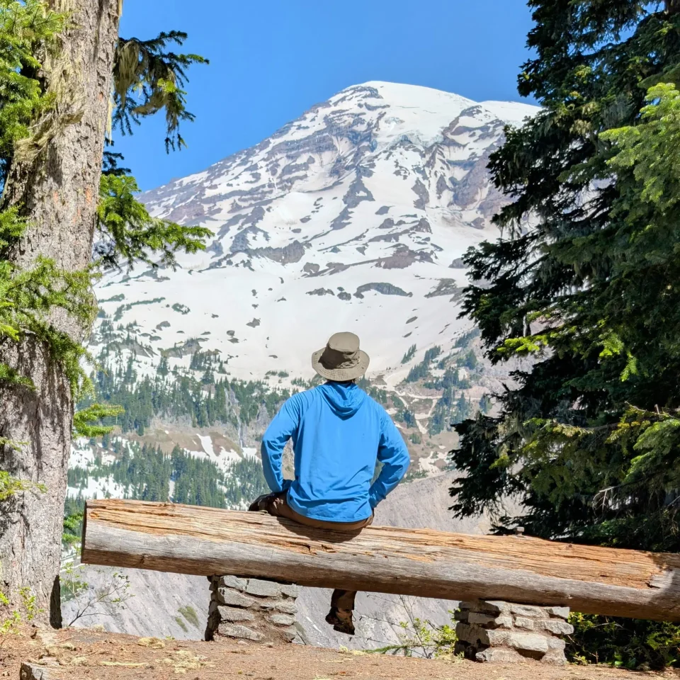
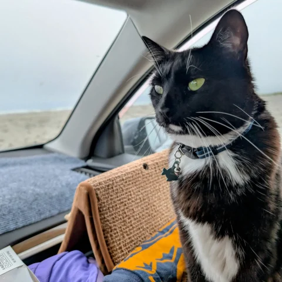
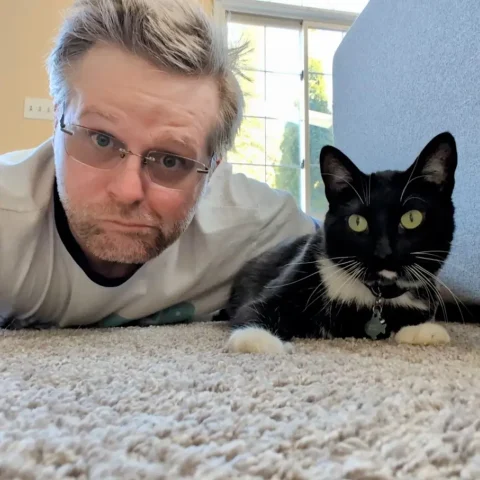
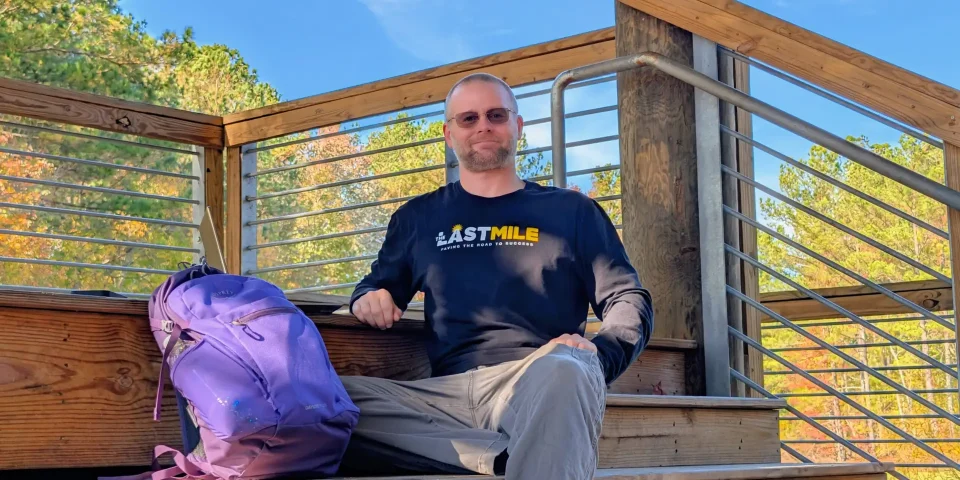
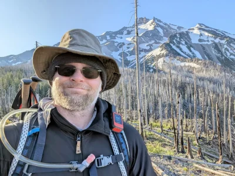

## MY

# JOURNEY

### ABOUT RCJ

Welcome to the heart of **RC Journey** – a unique platform dedicated to exploring the profound intersection of natural beauty, personal transformation, and the complex journey of reentry. Here, we believe in the power of shared stories, the healing balm of nature, and the relentless pursuit of a meaningful life after incarceration.

## What is RC Journey?

The "RC" in RC Journey stands for **Returning Citizen** (or Returned Citizen). This term acknowledges individuals who are transitioning back into society after a period of incarceration. RC Journey is a dynamic online space that serves multiple purposes:

- **A Travelogue with a Purpose:** I chronicle cross-country travels through America's stunning natural landscapes – from the serene forests to the majestic mountains. These journeys aren't just for sight-seeing; they serve as a powerful backdrop for reflection on the human spirit's resilience and the ongoing path of reentry.
    
- **A Mirror to Reentry Realities:** Juxtaposed against the breathtaking beauty of nature, I confront the "ugly truth" of reentry. This means openly discussing the systemic barriers and personal struggles that returning citizens face daily, such as securing housing, finding meaningful employment, and rebuilding relationships.
    
- **A Platform for Voices of Resilience:** I spotlight other returning citizens who have successfully navigated reentry. Through their candid interviews, I share their stories of triumph, the invaluable lessons they've learned, and the practical advice they offer to inspire and guide others.
    
- **A Personal Narrative:** This is also where I, your host and founder, share my [own story](https://thelastmile.org/brett-second-chance-programmer-prison-story/). My journey from incarceration to a fulfilling career as a Platform Systems Engineer for [The Last Mile](https://thelastmile.org), and now as a traveler and storyteller, is woven into the fabric of this platform. It’s a testament to the ongoing process of growth, adaptation, and finding one's place in the world.
    

   

## My MISSION

RC Journey's mission is to:

- **Humanize Reentry:** By sharing authentic stories and experiences, I aim to break down stigmas and foster greater understanding and empathy for returning citizens.
    
- **Inspire Hope:** Through the narratives of successful reentry and the beauty of nature, I provide a source of hope and encouragement for those on a similar path.
    
- **Educate and Inform:** I shed light on the challenges of reentry and highlight the resources and strategies that can lead to successful reintegration.
    
- **Build Community:** I aim to create a space where returning citizens, their loved ones, advocates, and anyone interested in criminal justice reform can connect, share, and support one another.
    

## MEET BRETT

My name is Brett. My own journey as a returning citizen has been one of profound learning and resilience. After 24 years of incarceration, I committed myself to a path of personal and professional growth. My role as a Platform Systems Engineer for [The Last Mile](https://thelastmile.org) is not just a job; it's a testament to the power of skill development, mentorship, and second chances. This remote position has provided me with the unique flexibility to embark on this RC Journey, allowing me to merge my passion for technology and travel with my deep commitment to supporting the reentry community.

[Youtube](https://www.youtube.com/@RC_Journey) [Linkedin](https://www.linkedin.com/in/brett-buskirk/) [Github](https://github.com/brett-buskirk) [Medium](https://medium.com/@brett-buskirk)

## Join the Journey

## Whether you're seeking inspiration, insights, resources, or simply a fresh perspective on what it means to rebuild a life, I invite you to explore RC Journey. Read my blog posts, listen to the powerful stories of our featured RCs, and connect with a community that believes in redemption, resilience, and the endless possibilities of a new beginning. Your journey is welcome here.

\[newsletter\_form\]
