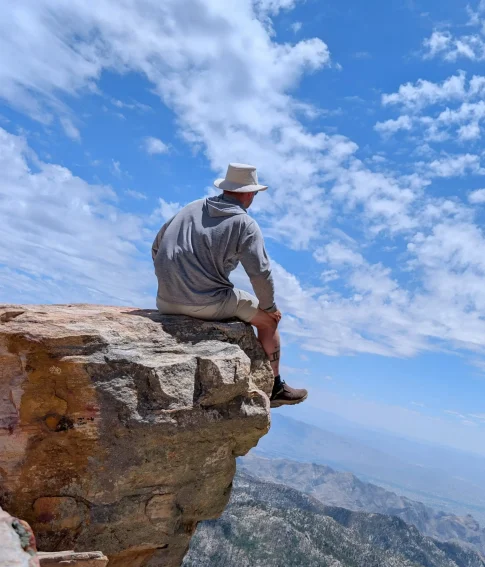
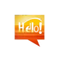
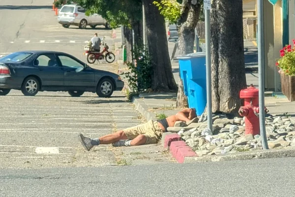
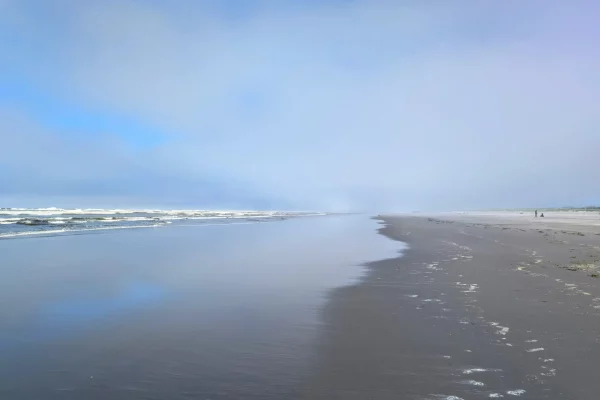
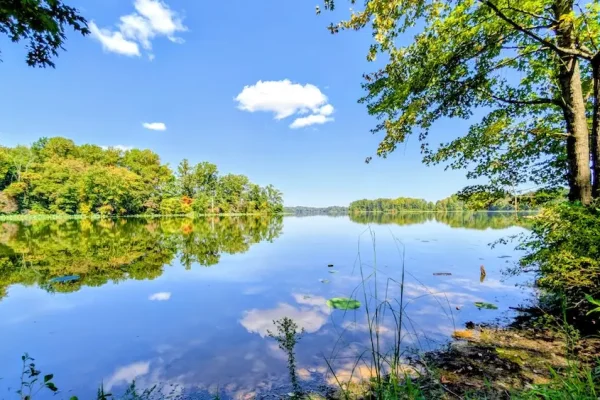
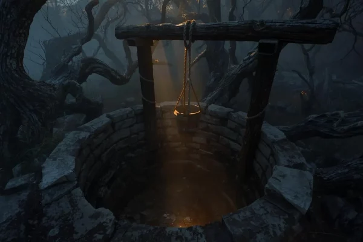

## Navigating new LandscapES

# INSIDE & OUT

##### Returning Citizen Reentry: Life After Incarceration

## Where Paths Converge

## Nature, Freedom, and Rebuilding Life

Welcome to **RC Journey**, a travelogue with a purpose. For those new to the term, an "RC" is a **Returning Citizen** – an individual navigating life after incarceration. I'm Brett, and as a returning citizen and Platform Systems Engineer for [The Last Mile](https://thelastmile.org/), I've created this space to explore the breathtaking natural beauty of the United States, from the majestic peaks of the Cascades to the serene depths of ancient forests. This isn't just about scenic views; it's a parallel exploration of the challenging, often unseen, path of returning citizen reentry, finding the profound connection between the wild's expansive freedom and the human spirit's quest for renewal.

Through [my own story](https://thelastmile.org/brett-second-chance-programmer-prison-story/) and the inspiring voices of others who have successfully reentered society, I confront the stark realities of finding housing, employment, and connection, while offering hope and practical insights. Join me as I traverse these diverse landscapes – both literal and metaphorical – in search of freedom, renewal, and a place to belong.

[More About RCJ](https://rcjourney.cloud/about/) 

##### Work & Wander

Over 10,000 miles traveled while working remotely and exploring the country.

##### RC Interviews

Hear the [Voices of Resilience](https://rcjourney.cloud/voices-of-resilience/) who have successfully navigated their reentry.

##### Great Shots

Check out the [Gallery](https://rcjourney.cloud/gallery/) for stunning pictures from around the U.S.

##### Reflections & Reviews

[Reflections](https://rcjourney.cloud/reflections/) and reviews blending nature and [Reentry Realities](https://rcjourney.cloud/reentry-realities/) together.

### READ THE

## STORIES

## [Reentry Realities](https://rcjourney.cloud/reentry-realities/)

Reentry Realities explores the systemic barriers and immense resilience of returned citizens in securing housing, employment, and rebuilding relationships after incarceration.

## [Reflections](https://rcjourney.cloud/reflections/)

Reflections delves into the profound inner world of returning citizen reentry, contemplating how nature's beauty serves as a powerful mirror to the complex journey back to society.

## [Shadowed Mirror](https://rcjourney.cloud/the-shadowed-mirror/)

The Shadowed Mirror archives raw reflections from the first year of my reentry after 24 years of incarceration, capturing the disorientation, small victories, and the emotional work of transforming an identity.

## [The Deep Well](https://rcjourney.cloud/the-deep-well/)

The Deep Well offers philosophical explorations of questions emerging from years of forced contemplation, examining fundamental questions about violence, transcendence, and human transformation.

## Check Out My Latest Articles

#### CONTACT ME

I'd love to hear from you! Whether you're a returning citizen with a story to share, an organization looking to collaborate, or simply have a question or comment about returning citizen reentry, please don't hesitate to reach out. Your insights and experiences are invaluable to our growing community.

###### Email:

[info@rcjourney.cloud](mailto:info@rcjourney.cloud)

## JOIN the JOURNEY

Want to dive deeper into the journey? By subscribing, you'll join a community dedicated to exploring these unique returning citizen reentry stories of resilience and renewal, delivered directly to your inbox.

\[newsletter\_form\]
