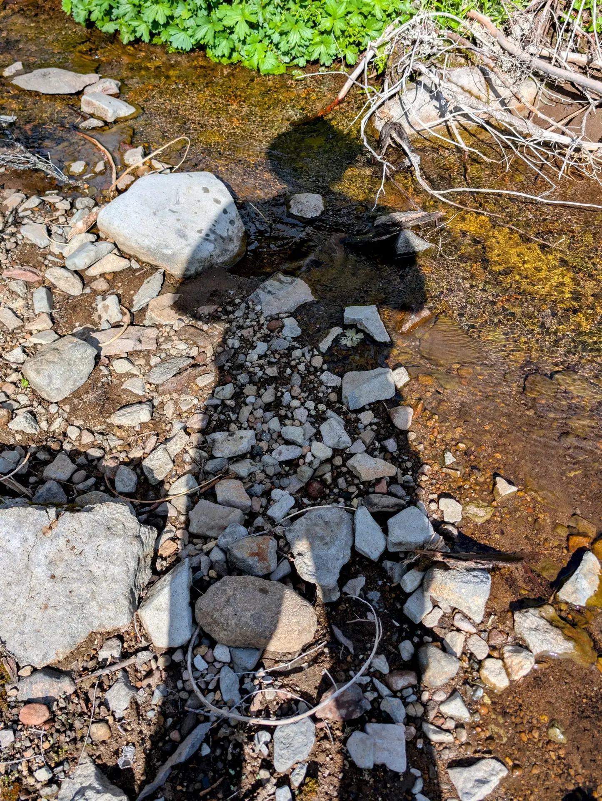

# REFLECTIONS

### Nature's mirror

## reflections ON reentry

## Welcome to My Contemplative Space

Welcome to **Reflections** on RC Journey, a truly unique space where the vast, untamed beauty of America’s natural landscapes meets the profound inner world of **returning citizen reentry**. In these articles, I delve into a singular contemplation, juxtaposing the breathtaking openness of mountains, forests, and oceans with the stark, often confining realities of incarceration and the complex path back to society. Here, every vista becomes an opportunity for deeper insight.

### Nature as a Mirror to Reentry

Why this blend of wilderness and personal journey? Because nature, in its raw power and timeless cycles, serves as a powerful mirror. Its challenges, resilience, and boundless freedom offer a striking contrast to the controlled environments and systemic hurdles faced by individuals after incarceration. Through this intentional juxtaposition, I aim to reveal not only the external difficulties many endure but also the incredible internal strength required to adapt, heal, and thrive. These reflections illuminate the shared human experience of navigating vast, often unpredictable, landscapes, both literal and metaphorical.

### Journeys of Inner and Outer Landscapes

Each piece in this section is an introspective observation, born from personal experiences traversing the country's wild places. From the silent grandeur of ancient redwoods to the explosive power of geysers, these physical journeys inspire deeper thoughts on recovery, finding purpose, and rebuilding trust. They offer an intimate look at how quiet moments in the wild can spark profound insights into the ongoing process of finding freedom, not just from walls, but within oneself.

## Join the Contemplation

I invite you to join me in these contemplative journeys. Whether you're a returning citizen, a loved one, or simply someone seeking a deeper understanding of the human spirit's capacity for resilience, these reflections offer a unique perspective. Explore how the external world can help us process and understand the internal landscapes of transformation, as we collectively seek deeper understanding, healing, and freedom in the wild, and within ourselves.

## Reflections
