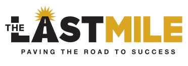
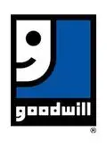
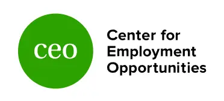

## RESOURCES &

# SUPPORT

### FIND THE RESOURCES & Support

## FOR SUCCESS

For those on the reentry journey, or their loved ones, finding reliable resources and support is crucial. This section provides a curated list of organizations, programs, and tools that offer support in areas like legal aid, job training, mental health, and housing assistance. We're building a community of resources and support for returning citizens, one step at a time.

## Employment & Job Training

## The Last Mile

A team of social innovators who are breaking the cycle of incarceration with technical education and training that champions students’ success after their release.

[Learn More](https://thelastmile.org) 

## Goodwill Industries

Job training programs (including for justice-involved individuals), career development services, resume building, interview practice, and employment placement assistance.

[Learn More](https://www.goodwill.org/) 

## CEO

**Center for Employment Opportunities**. Immediate, paid transitional employment, skill-building, and job placement services for returning citizens.

[Learn More](https://www.ceoworks.org/) 

## Indiana Prison Writers Workshop

A program dedicated to improving the lives of incarcerated people through creative writing and expression.

[Learn More](https://inprisonwritersworkshop.org/)
