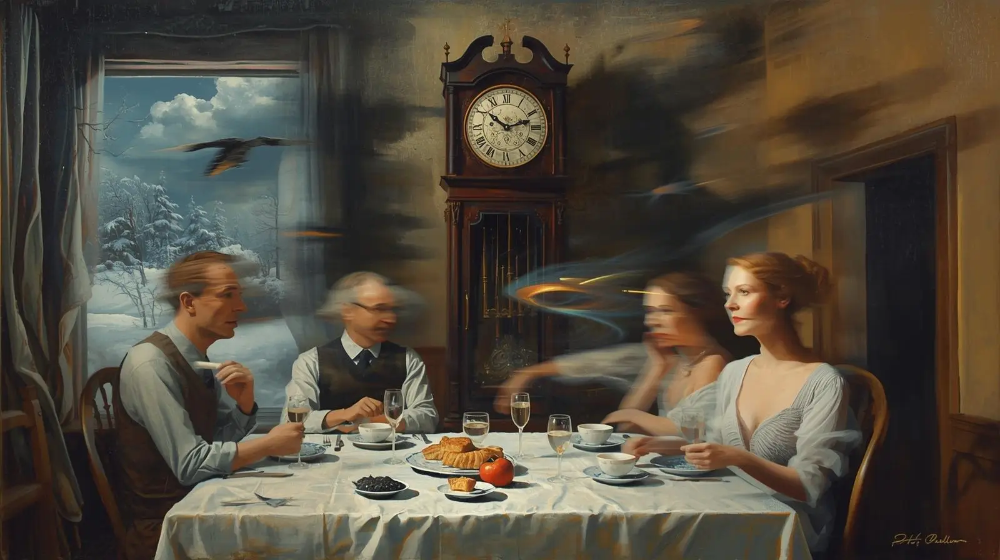

Tick. Tick. Tick...

The rhythmic ticking of the old grandfather clock fills the heavy silence hanging between us. The steam from the food snakes its way up to the ceiling where it meets its end against the sharply stuccoed surface. Everything is neatly arranged on the table in front of us like pieces on a chessboard. The wind outside is howling with its ghostly voice, pressing against the old house like a giant threatening to tip it over. Glancing out a window, something captures my attention: a few snowflakes streak by — icy meteors in the night. Only then do I notice the warmth of Max (or is it Molly?) curled up at my feet, sleeping soundly and dreaming of whatever it is rottweilers dream.

Tick. Tick. Tick...

The silence is making me uneasy. No one moves to fill their plates with the rapidly cooling food. Why can't I discern what it is? My parents are looking at me expectantly, waiting... It must be my turn to say grace, but no words are coming to mind. This always happens to me. I find praying uncomfortable, especially in front of other people — family or not. I try to unearth the right words; dig them up from the barren soil of my mind. My mouth opens and closes like a fish out of water in vain attempts to begin; my heart is racing, beating so hard I can feel it in my ears. I know I have to say something before I freeze like the icicles hanging from the mailbox outside.

Tick. Tick. Tick...

My parents nod and mouth "Amen." Did I force out a prayer? What did I say? I don't know. It doesn't matter; I always say roughly the same thing, anyway. We load up our plates with the homemade meal. Did I cook this time or was it my step-mother? I arrange the food neatly on my plate, careful not to let anything touch each other. The mixing of food is like an artist blending all his paints together on a pallet, creating only a muddy brown. It is uncivilized, ugly, and it doesn't belong at the dinner table. Is that my belief, or someone else's? A tall glass of milk stands proudly in front of me, condensation slowly creeping down the side and forming a puddle at the base. I prod with my fork at whatever is on my plate, waiting for my parents to speak and break the silence.

Tick. Tick. Tick...

My dad's lips are moving; is he talking or chewing? I cannot hear any words. My step-mother laughs, covering her mouth, but the sound of it is absorbed by the layers of years between then and now. I'm staring at ghosts who don't realize what they are. The dog shifts uncomfortably at my feet and looks around, almost like she (or he) senses me reaching back through the veil of time. I put my spoon down and take a drink of water. Wait, wasn't it milk just a second ago? What is going on here; why is my memory failing me? Why is the silence so loud?

Tick. Tick. Tick...

Everything is moving faster now; I can barely keep up. My parents are shoveling food into their mouths like coal into a furnace. They nod and gesture and shake their heads, but I have no idea what they are talking about. The silence is unruly; it is juxtaposed against the flurry of action I am witnessing. It all becomes a blur of motion. The water becomes milk again, then back to water. The food changes, too, back and forth across the spectrum of possibilities. The shadows start to creep in from the edges, swallowing the scene like an eclipse. Our clothes scintillate on our bodies, shifting between every color imaginable, too quickly to follow. The view from the window flows seamlessly through all the seasons — snow and rain and sunshine all at once. The hands of the grandfather clock whirl like dervishes. I clench my fists and scream as the edge of the encroaching darkness reaches me.

Tick. Tick. Tick! Tick! Tick! **TICK!**

The scene atomizes into brilliant white light, banishing the darkness temporarily before it returns and consumes everything. Nothing is left but empty shadows. If I had known someone sharing the table with me would be dead within a week, perhaps I would have paid more attention. Though it was over twenty years ago, I can still remember the details of that last dinner I shared with my family. The details, however, are another matter entirely. They are shadows of the past; obscured by the gloom of the interposing years. When I attempt to shed light on them, they disperse like smoke in the wind. The only way to recall even a fraction of what they were is to stride into the umbral landscape and peer into the darkness.

Silence...

I am left to ponder the implication of my memory. Has my mind abandoned me? Have I lost my grasp on reality? Or, is it possible the memory was manifold? In struggling to remember the last dinner I shared with my parents, perhaps I remembered them all, bound together beyond space and time. Who can make sense of such things? Perhaps I should have paid better attention to the little moments of my life; perhaps then I could have recalled more details. Who knows?

Perhaps I'm just insane...
