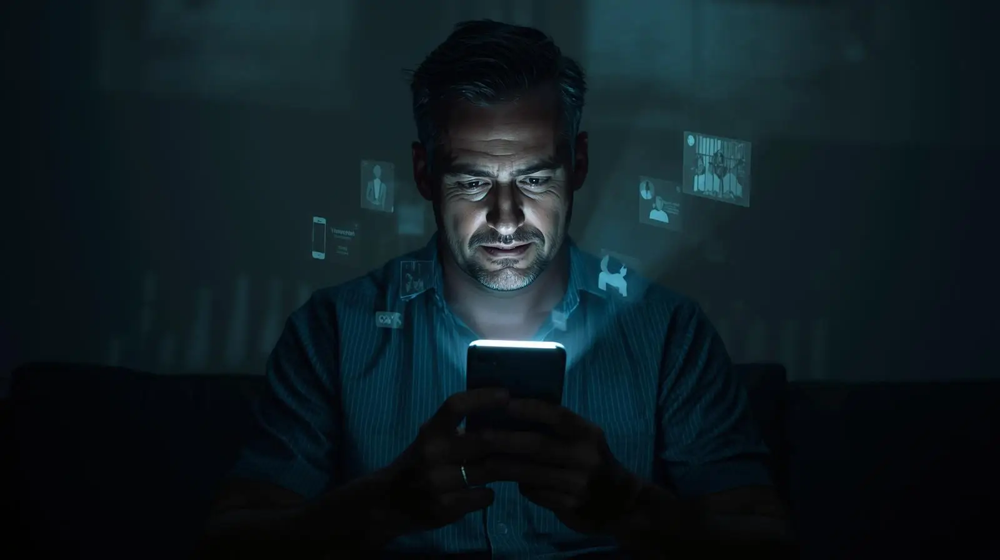

_**Originally posted January 30, 2021**_

One week. Seven days. 168 hours of freedom — though who's counting? The rapid pace of change makes it feel simultaneously like seven years and seven minutes. While I was locked away for nearly two and a half decades, the steady march of technology accelerated exponentially, reshaping not just the physical world but the very nature of human connection.

The people I once knew have either vanished entirely or changed so drastically that meeting them feels like encountering strangers who happen to share familiar names. It's a peculiar form of time travel — stepping back into lives that continued evolving while mine remained frozen in amber.

## Digital Exploration and Pizza Victories

Despite the overwhelming nature of these changes, I'm moving forward without fear. The weekend brought new adventures in digital exploration. I continued mapping the internet's vast territories, setting up social media accounts and downloading apps that would have seemed like science fiction in 1997.

One particularly satisfying milestone was ordering pizza through the Pizza Hut app. This simple act — selecting toppings on a touchscreen, tracking delivery in real-time, paying digitally — represented a conquest over the alien technology that surrounded me. I also installed Zoom, Duo, and Google Meet, platforms that would become lifelines to my expanding support network.

Virtual meetings with friends, family, and my new colleagues at The Last Mile became a source of connection that transcended physical boundaries. The irony wasn't lost on me — after years of craving human contact, I was now conducting meaningful relationships through screens.

## Reconciliation and Awkwardness

Saturday evening brought an unexpected visit from my uncle and his wife — the first time we'd seen each other since before my incarceration. The initial awkwardness was palpable, filled with the weight of lost years and unspoken questions. They'd brought photo albums documenting the lives of cousins who had grown up, married, and started families while I served my sentence.

My aunt's honesty was both painful and refreshing: "We just didn't know what to say." Her words encapsulated the challenge many families face when a loved one is incarcerated — the paralysis that comes from not knowing how to bridge such a profound gap.

Yet seeing those photos, learning about everyone's successes and milestones, filled me with genuine happiness. These weren't abstract relatives anymore; they were real people living full lives, and I was being invited back into that narrative.

## The Insomnia Challenge

Sleep continued to elude me throughout the weekend. Information overload combined with the raw excitement of freedom created a perfect storm of insomnia. My brain, accustomed to the numbing routine of institutional life, was now processing stimuli at a rate that made rest impossible.

Google became my companion during those long, wakeful hours. I explored everything — catching up on world events, learning about technological advances, researching topics that had been inaccessible for decades. Each search led to ten more questions, creating an endless rabbit hole of discovery.

While the sleep deprivation was becoming annoying, I recognized it as a temporary side effect of cognitive overload. My lifelong tendency toward insomnia was actually serving me well — I was used to functioning on minimal rest.

## Sunday: Faith and Community

Church attendance with my parents provided a different kind of homecoming. Getting out of the house for a few hours felt liberating, and meeting new people in a welcoming environment offered hope for rebuilding my social network.

I encountered several people I'd known in childhood, now adults with their own families and stories. Their acceptance was immediate and genuine — no one treated me as a pariah or curiosity. They offered donuts and orange juice with the same warmth they'd show any newcomer, and their invitation to return felt sincere.

This experience challenged my assumptions about how the community would receive me. Rather than judgment or suspicion, I found ordinary human kindness.

## A Mother's Love

The afternoon brought an emotionally charged visit from my biological mother and step-father. They arrived bearing gifts that revealed their deep understanding of my needs — practical items like a fan, pens, and paper mixed with comfort foods and personal touches.

The gesture of my father and step-mother gracefully leaving to give us privacy demonstrated the careful choreography required when multiple family systems converge around a returning citizen. Everyone was navigating uncharted territory with remarkable sensitivity.

Seeing my mother outside a prison visitation room for the first time since my childhood created an almost surreal sense of completion. Our relationship, forged in the crucible of my incarceration, could finally exist in normal spaces. We talked for hours, both marveling at the simple miracle of being together in a living room instead of across a metal table surrounded by guards.

Her presence in my life had been a constant source of strength during the darkest periods of my sentence. Now, finally, we could begin building a relationship unmediated by institutional constraints.

## Digital Connection Across Distance

The day's emotional peak came through an Instagram video call with my niece, extending until 2:30 AM. She gave me a virtual tour of her room, shared her dreams and ambitions, and reminded me that family bonds can survive even decades of separation.

Her intelligence and personality shone through the screen, filling me with pride and gratitude. Living several states away, she could have remained a stranger. Instead, technology was allowing us to build a real relationship, bridging the gap between her childhood and my freedom.

After our call, exhaustion finally overtook excitement, granting me a few precious hours of sleep.

## Professional Preparation

The remainder of the week focused on organizing my professional life. As a newly-minted web developer, I began setting up portfolios, researching current technologies, and connecting with industry networks. The field had evolved significantly during my absence, requiring intensive study to close knowledge gaps.

The Last Mile had already offered me employment before my release — an incredible vote of confidence that filled me with both gratitude and determination. We began the hiring process, with a start date set for the following Monday. The prospect of working with people I genuinely considered family made the transition feel less daunting.

## A Sister's Tears

Monday brought perhaps the most emotionally powerful moment of my first week: a visit from my sister. Born just before my adoption and later placed with a different family, she represented a connection to my earliest identity. We'd reconnected during my incarceration when she turned seventeen, developing a bond that sustained me through some of my darkest years.

Her reaction to seeing me in the doorway — an immediate burst of tears and a hug that temporarily stopped my breathing — crystallized the reality of what we'd all endured. The visiting room relationships of prison could never capture this intensity of connection.

She stayed until midnight, sharing photos and stories from her life, bridging the years through shared memories and newfound presence. Her support had been crucial during my incarceration; now we could finally experience the normal rhythms of sibling relationship.

## Bureaucratic Realities

Attempting to establish basic adult infrastructure revealed the catch-22 nature of reentry logistics. I needed a bank account for employment, which required a state ID, which demanded a Social Security card — which I didn't possess.

The Social Security replacement process promised to be a bureaucratic nightmare until my father suggested searching through old family documents. After hours of archaeological excavation through file cabinets, I found my original card — a small victory that felt monumental.

The BMV experience provided another lesson in post-incarceration realities. I received a temporary paper ID (insufficient for banking) while waiting for the official version to arrive by mail. Reinstating my driver's license would require $150, plus retaking both written and driving tests. The home detention requirement added another layer of complexity — everything had to be scheduled a day in advance.

These obstacles felt less like barriers and more like puzzles to solve. Each small victory built momentum for the larger challenges ahead.

## Looking Forward

As I enter my second weekend of freedom, hope dominates my emotional landscape. Monday would bring my first day of employment in 25 years — a milestone that represented far more than income. It symbolized productivity, contribution, and the chance to use my skills in service of something meaningful.

The weekend agenda focused on organizing my living space and maintaining connections with my expanding network. While much work remained ahead, the foundation was solidifying with each passing day.

The road forward was becoming clearer, marked by achievable milestones and supported by a community that genuinely wanted to see me succeed. For someone who had spent 24 years with minimal control over his environment, the simple act of planning my own weekend felt like a profound luxury.

**One week down, a lifetime to go. The mirror reflects not just where I've been, but the infinite possibilities of where I'm headed.**
