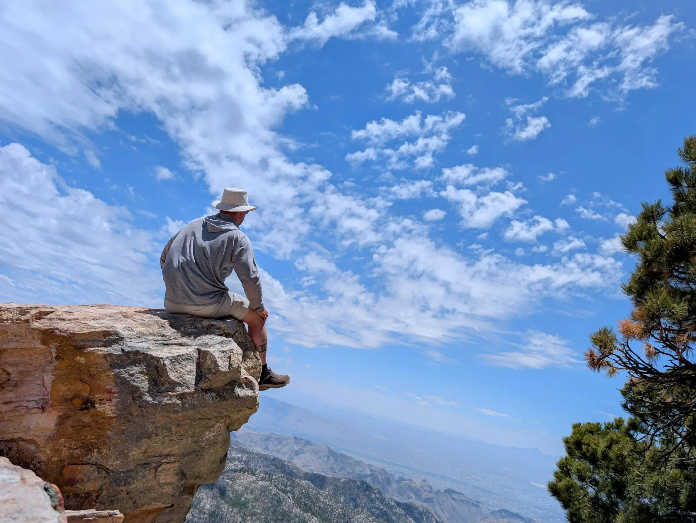

## **The Weight of Five Years**

Five years ago today, I walked through the gates of prison after 24 years of confinement. 1,826 days of freedom now stand against 8,760 days of incarceration. The mathematics are stark, yet the subjective experience defies simple calculation. How do you measure transformation? How do you quantify the distance between the man who shuffled through those gates in shackles and the person I've become?

Five years. It feels simultaneously like five lifetimes and five minutes compressed into a paradox of temporal experience that continues to confound me.

## **The House Where Everything Changed**

My freedom began in the last place I expected: home detention in the very house where I had committed my crime nearly a quarter-century earlier. The irony wasn't lost on me then, and it remains sharp in memory now. Walking through that front door with a GPS monitor clamped around my ankle, I was confronted with ghosts I had long tried to reconcile from the safety of distance.

Every room held echoes of decisions that had destroyed lives, including my own. The walls remembered things I had spent decades trying to understand, to process, to somehow make peace with. That house became my first crucible of reentry — a place of necessary reckoning rather than sanctuary.

I couldn't escape the past because I was living inside it. Perhaps that was exactly what I needed.

## **Loss Upon Loss**

Three months after my release, my stepmother died from COVID-related complications. The pandemic that had consumed the world during my final year inside had reached into my family with devastating efficiency. She was gone before I had time to fully reconnect, before I could bridge the years of separation with the kind of healing conversations I had imagined during those long nights in prison.

The grief was compounded by helplessness. I was still on home detention, still tethered to that GPS monitor, unable to fully participate in the mourning rituals that bring families together. Loss in freedom, I discovered, cuts differently than loss in prison. There's no emotional armor to hide behind, no survival mechanisms to numb the pain. I had to feel it completely.

Then, just this past April — barely four years into my freedom — my biological mother died. Two mothers lost in the span of four years. The magnitude of that absence is something I'm still processing, still learning to carry. These deaths have marked my reentry in ways I never anticipated during those years of planning and preparation.

Grief, I've learned, doesn't follow a timeline or respect your readiness for it.

## **The Relentless Forward Motion**

Between these losses, I refused to let stillness take root. The drive to keep moving — to make up for lost time, to prove something to myself and the world — became the engine that propelled me through early reentry and continues to power me today.

After two years of home detention, after that GPS monitor finally came off my ankle, my friend John and I embarked on a cross-country road trip to San Francisco to meet our co-workers face-to-face for the first time. The journey itself became as significant as the destination. We stood at the edge of the Grand Canyon, stayed at the Bellagio in Las Vegas, traversed the alien landscape of Death Valley. Each stop deepened our friendship in ways that video calls and Slack messages never could.

When we arrived in San Francisco, I decided to stay. The city represented everything I'd been deprived of — anonymity in crowds, cultural density, the constant pulse of urban possibility. I wanted to see what big city life was all about, to test myself against an environment that bore no resemblance to anything I'd known before or during incarceration.

Three months later, I returned home nearly broke and thoroughly befuddled by the difference in mentality. San Francisco wasn't bad, just fundamentally different from what I was used to. The pace, the priorities, the cost of existing in that city — none of it aligned with the person I was becoming. The experiment taught me valuable lessons about knowing myself and recognizing when something isn't the right fit, no matter how appealing it looks from a distance.

Back in Indiana, I tried to settle into a more conventional life. I entered a relationship that seemed promising at first, another attempt at building normalcy. But as my mother's cancer progressed, as I watched her dying and felt the weight of impending loss, that relationship fractured. It ended unfriendly, adding another layer of grief to an already devastating period.

After my mother died last April, something shifted. The accumulation of loss — my stepmother, my mother, a failed relationship — created a clarity I hadn't possessed before. I needed to stop trying to fit into a life that wasn't mine. I needed movement again.

So I hit the road as a full-time digital nomad. No home base, no apartment lease, no pretense of conventional stability. Just my laptop, my work, and an open road that finally matched my internal restlessness. I embraced an existence that married my remote work as a software engineer with an insatiable hunger for discovery and movement.

## **Mountains as Teachers**

The nine great national parks I've visited over these five years have become landmarks on my internal map as much as external destinations. Yellowstone taught me about the volatile beauty hidden beneath seemingly stable surfaces. The Grand Tetons showed me that some obstacles are meant to be contemplated rather than conquered. Mount Jefferson reminded me that standing on giants — on the shoulders of those who supported me — is how we reach impossible heights.

Each wilderness experience reinforced the same lesson: true freedom means possibility, choice, and the profound privilege of simply existing in spaces so vast they make your past feel small.

Living from campgrounds and mountain wildernesses, I found a rhythm that matched my internal pace. The discipline required for backcountry camping — planning, preparation, self-sufficiency — drew directly from skills prison had forced me to develop. I was thriving in forests and peaks where I'd once merely survived in concrete and razor wire.

Backpacking taught me that what you carry matters. Every item in your pack must justify its weight. The metaphor wasn't subtle, and I paid attention.

## **Professional Evolution**

Ten days after walking out of prison, I started my first day of work as a Junior Web Developer at [The Last Mile](https://thelastmile.org) — the organization that had trained me while I was incarcerated. They hired me before my release, giving me something precious: certainty that I wouldn't be stepping into the void with nothing. That job gave me income and something equally important — proof that someone believed in my potential beyond my past.

Over five years, I've grown within TLM in ways I couldn't have imagined on that first nervous day. From Junior Web Developer to Remote Instructor — calling into facilities to teach web development to people facing the same challenges I once navigated. Seeing these students progress from basic computer literacy to sophisticated coding skills reminds me how much growth is possible even in the most restrictive environments. Their determination and creativity inspire me while allowing me to contribute something valuable to their preparation for eventual reentry.

For the past three years, I've served as a Platform Systems Engineer, building and maintaining the infrastructure that supports TLM's mission. The technical complexity of the work challenges me daily, pushing me to learn and adapt in ways that keep the role engaging rather than routine.

Beyond TLM, I've built a professional life that would have seemed impossible five years ago. Contracting in cybersecurity. Building web applications as a software engineer. The technical skills I developed in a prison classroom without internet access now support me in a competitive field where most developers can't imagine working without Google and Stack Overflow.

The fact that I know how to do this stuff — that I can solve complex problems and architect solutions to challenges that didn't exist when I was incarcerated — still amazes me. The learning curve has been relentless, and mastery of these skills represents career success and something deeper: proof that the human brain maintains plasticity even after decades of confinement, that adaptation and growth remain possible at any age.

## **Love in the Time of Reentry**

I met Linda while living on the road. After the losses and failed relationships, after choosing movement over stability, partnership was the last thing on my mind. Life has a way of delivering what you need precisely when you've stopped demanding it.

On October 31st of last year, I married her. Halloween seemed fitting for a man who has spent his life wrestling with his own demons. Beyond the symbolic date, the marriage represents something I never thought I'd experience: genuine partnership, trust, and the kind of intimacy that requires complete vulnerability.

Relationships after incarceration are complicated terrain. The walls I built for survival inside don't come down easily. Learning to be present, to be emotionally available, to allow someone to truly see me — these have been some of the hardest lessons of reentry.

Linda has shown me patience I didn't know existed. She sees the person I've become without ignoring the person I was. That kind of acceptance is a gift I'm still learning to receive gracefully. More than that, she shares my restlessness, my hunger for movement and discovery. She doesn't just tolerate my nomadic tendencies — she embraces them.

## **The Brutal Honesty of Reentry**

Five years in, I can say with certainty: reentry is brutal. Anyone who tells you otherwise is selling something or hasn't actually done it.

The practical challenges — rebuilding credit, finding housing, securing employment, navigating bureaucracy without a recent history — are exhausting. The psychological challenges cut even deeper. The constant vigilance against old patterns. The hyper-awareness of how others perceive you once they know your history. The imposter syndrome that whispers you don't deserve the life you're building. The survivor's guilt for those still inside. The grief for time lost that can never be reclaimed.

Some days, the weight of simply existing in the world feels overwhelming. The sensory assault, the rapid pace, the infinite choices, the pressure to be "normal" — it all compounds into a exhaustion that goes beyond physical tiredness.

Here's what I've learned through five years of this brutality: reentry is difficult and possible. The key is accepting that you'll never go back to who you were before prison. The goal is to become someone new, someone who can integrate the hard-won wisdom of incarceration with the expansive opportunities of freedom.

## **The Long View, Revisited**

Prison taught me to plan in years and decades rather than days and weeks. This "long view" has become one of my greatest assets in building a sustainable life. While others chase immediate gratification or get discouraged by slow progress, I'm comfortable playing the long game.

Five years feels significant because it is. It's also just one milestone on a much longer journey. The foundation is solid now — employment, marriage, community, purpose. What I build on this foundation over the next five years, and the five after that, will determine whether I've truly succeeded at this reentry thing.

## **Gratitude for the Journey**

None of this transformation happened in isolation. Family members who refused to give up on me. Friends like John, who was also incarcerated in Michigan and became my co-worker at TLM, sharing that first taste of real freedom on a cross-country road trip. Colleagues at TLM who believed I had something valuable to contribute. Mentors who shared their wisdom without judgment. Linda, who chose to walk this path beside me and dream new dreams together.

The support network that sustained me through reentry represents a privilege I never take for granted. I know too many returning citizens who face this journey without such resources, such grace, such second chances. Their absence in these acknowledgments reflects systemic failure, not personal shortcoming.

## **Keep Moving Forward**

To anyone reading this who is still inside, counting down their own days: freedom is coming. The wait is agonizing, I know. Use that time to prepare, to learn, to develop the skills and mindset that will serve you when the gate finally opens. But also know that nothing can truly prepare you for what comes next. The gap between imagination and reality is vast.

To those recently released, struggling through early reentry: it gets easier, though never easy. The first year is survival. The second year is stabilization. By year three, you might actually have moments where you're living instead of merely surviving. Give yourself grace. The timeline is longer than anyone admits.

To the supporters, the families, the friends who love someone navigating this journey: your patience means everything. We know we're difficult. We know we're carrying damage that affects how we show up in relationships. Thank you for seeing past the rough edges to the person we're becoming.

## **Canvas to Cabin: The Next Chapter**

This spring, Linda and I are embarking on our next adventure together. We're heading to the Pacific Northwest — Oregon, Washington, or even Alaska — in search of our forever home. We're going to find land where we can build a cabin with our own hands.

We're calling this leg of our journey "Canvas to Cabin." We'll be living in a canvas Kodiak lodge tent with a woodburning stove, two digital nomads searching for the place where we'll finally put down roots. The tent will be our home while we explore, while we search for that piece of land that speaks to us, while we transition from perpetual movement to intentional rootedness.

The irony isn't lost on me. After 24 years in a cell, after five years of restless motion, I'm choosing to build my own small enclosure in the wilderness. Walls that contain you and walls you build yourself are profoundly different. Confinement and sanctuary. A cage and a home. The difference matters.

Over these five years, I've traveled nearly every climate this country has to offer. Desert heat and mountain cold. Coastal humidity and prairie dryness. Urban density and rural isolation. Each landscape taught me something, but none spoke to me the way the Pacific Northwest does.

The mountains. The alpine forests. The altitude. The wide open spaces. The wilderness that stretches beyond what the eye can see. The wildlife moving through terrain that remains fundamentally wild despite human presence. Something about that combination of elements resonates with who I've become and who I'm still becoming. It feels like the right place to finally stop running and start running toward a future that Linda and I will build together.

## **Five Years and Counting**

Standing here at the five-year mark, looking back at the terrain I've covered and forward at the miles ahead, I feel something I didn't expect: peace. Peace with purpose woven through ongoing struggle. Peace with the journey continuing and confidence in my ability to keep walking — and now, perhaps, to finally stop and build something that lasts.

The mirror that was shadowed for so long now reflects someone I'm beginning to recognize — imperfect, unfinished, authentically and determinedly alive.

Five years free. Canvas to cabin. A lifetime of possibility ahead.

Keep moving forward, then build where you belong.
