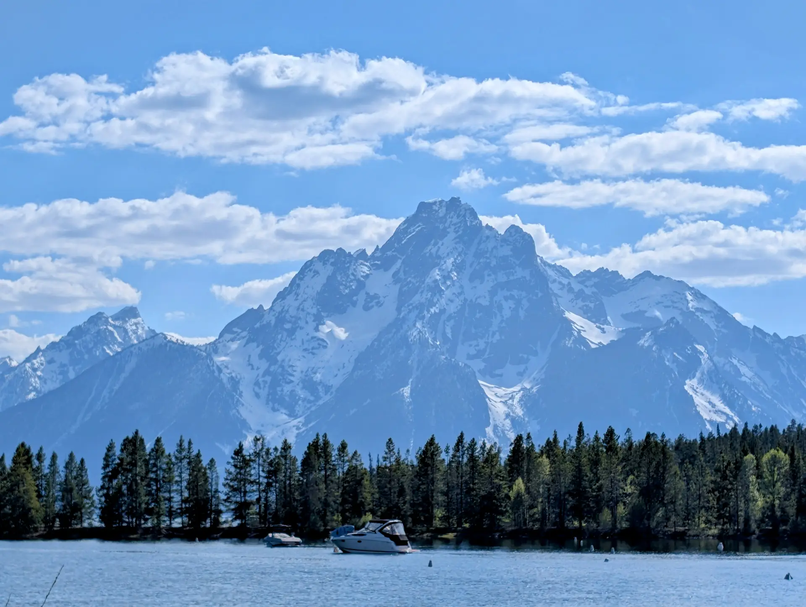

### **Grand Teton's Majestic Reveal**

The Grand Tetons don’t so much rise as they _erupt_ from the earth, a jagged, impossibly sharp skyline that tears at the sky with an almost violent beauty. Driving into the park, the reveal is sudden and breathtaking. One moment, you’re on a relatively flat plain; the next, an ancient, colossal wall of granite looms, its snow-capped peaks piercing the clouds, casting their immense shadow over the pristine expanse of Jackson Lake. It’s a vision that dwarfs you, yet simultaneously fills you with an immense sense of awe and possibility. This profound beauty sets the stage for a deep Grand Teton reentry reflection.

Here, in the heart of Wyoming, the silence is profound, broken only by the whisper of wind through pines or the distant call of an osprey. This vast, unfiltered expanse of wilderness stands in stark, immediate contrast to the world I once knew. My memories drift back to the meticulously engineered, utterly inescapable walls that once dictated my existence – the man-made boundaries designed to contain and control. The Tetons are also a wall, but one forged by millennia of geological forces, inviting wonder rather than confinement.

### **Mountains of Obstacles, Depths of Reflection**

Standing by Jackson Lake, its calm, reflective surface perfectly mirroring the towering peaks, I felt a deep sense of peace, yet also a powerful connection to the struggle. Those mountains, so impossibly grand, symbolize the monumental obstacles that often stand between a **returning citizen** and a truly re-integrated life. Securing stable housing, finding meaningful employment, rebuilding shattered relationships, navigating a world that often views you through the lens of your past – each can feel as daunting and unyielding as a granite peak. You know they are there, you know you must somehow get over or around them to reach the freedom on the other side. This is a core part of the Grand Teton reentry reflection.

The lake itself, so tranquil on the surface, hints at hidden depths, cold and immense. This resonated with the internal landscape of reentry. Beneath the calm exterior many **returning citizens** present, lie profound emotional depths – the echoes of trauma, the quiet struggle with self-worth, the immense pressure to “prove” oneself worthy. Like the lake reflecting the mountains, we reflect our past, but also strive to mirror the aspirations of our future, hoping to present a serene surface while navigating complex undercurrents.

### **The Enduring Spirit of Resilience**

There’s an ancient, enduring quality to the Tetons. They have stood for eons, weathering storms and change, yet remaining fundamentally themselves. This mirrors the resilience I witness daily in the reentry community, and certainly in my own **reentry journey**. Despite the profound societal challenges and personal hardships, **returning citizens** demonstrate an incredible capacity to endure, to adapt, and to find new ways to rise. Just as the Tetons endure, so too does the human spirit persevere, even after profound confinement and adversity.

My time as an engineer for [The Last Mile](https://thelastmile.org) has shown me the incredible potential within justice-involved individuals, and journeys like this one, to Grand Teton, vividly underscore that potential. This landscape is a powerful reminder that true freedom isn’t just about the absence of walls, but the presence of possibility, of self-determination, and the inner strength to navigate towering challenges.

### **RC Journey: Illuminating the Path Home**

RC Journey is about bringing these contrasts into focus. It’s about using the magnificent tapestry of America’s wilderness to illuminate the unseen battles and incredible triumphs of those striving to truly come home. From the starkness of concrete to the grandeur of these ancient mountains, the path of reentry is a profound expedition of the human spirit – a journey demanding resilience, hope, and the unwavering belief that every peak, no matter how high, can eventually be summited. This Grand Teton reentry reflection serves as a beacon for this ongoing quest.

## Gallery

