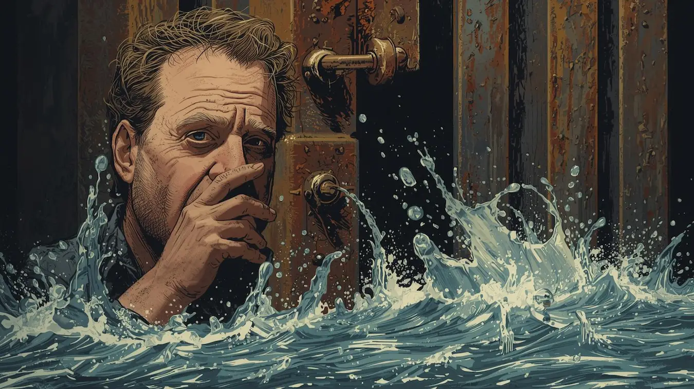

_Originally posted March 13, 2021_

In my experience, the most challenging trait to preserve in prison is basic humanity. Few people can maintain normal human characteristics like compassion, empathy, or genuine kindness after years of being caged and treated as less than human. Holding onto these qualities requires a conscious, daily decision — and there are severe costs associated with making that choice.

Prison culture operates on the assumption that humanity equals weakness. The unspoken expectation is to remain cold, apathetic, and ruthlessly self-serving. Any display of kindness or charity is met with suspicion and distrust. Showing love or concern for others creates vulnerabilities that predators will attempt to exploit.

Even something as simple as leaving an address book unguarded can lead to devastating consequences. Opportunistic inmates might copy your loved ones' contact information and attempt to extort them for money in exchange for your safety — a time-tested scam that preys on families' fears and desperation.

## The Protective Veneer

The easiest survival mechanism is developing a thick veneer of detachment from everyone and everything you care about. This emotional distancing isn't just surface-level performance — it often penetrates much deeper than initially intended.

Many people gradually lose access to their emotions without realizing what's happening. The protective numbness that begins as a conscious survival strategy slowly becomes involuntary. Eventually, they reach a point where even if they notice the emotional void, the safety it provides outweighs any concern about what's been lost.

This psychological armor serves a crucial function in a dangerous environment. But like any armor, it becomes increasingly difficult to remove the longer you wear it. What starts as protective gear can transform into a prison of its own, isolating you from the very connections that make life meaningful.

## The Daily Battle

I was fortunate to maintain some fragment of my original humanity throughout my incarceration, though preserving it required constant vigilance. I fought daily to protect whatever compassion remained, to resist the cynicism that infected almost everyone around me, to remember that the person I'd been before prison was worth recovering.

This battle wasn't always successful. There were periods — sometimes lasting months or even years — where I lost the fight completely. The emotional numbness would settle over me like a fog, making everything feel distant and unreal. During these dark phases, I functioned on autopilot, going through the motions of existence without feeling much of anything.

The difference between surviving these periods and being permanently damaged by them was the presence of people who refused to let me disappear entirely. Family members and friends maintained contact even when I couldn't reciprocate their care. They continued to remind me of who I was beneath the institutional facade and, more importantly, who I could become again.

I owe these people more than words can express. Their persistent love and faith in my potential provided anchors that prevented me from drifting completely away from my authentic self.

## The Reentry Challenge

Now that I've become a returned citizen, the battle has shifted fronts but hasn't ended. My humanity is alive and functional, but my ability to express it remains somewhat suppressed. I feel the full range of emotions — love, gratitude, concern, joy — but communicating these feelings effectively continues to challenge me.

This isn't about fear of vulnerability, exactly. It's more about lacking the practice and skill required for healthy emotional expression. After spending decades concealing my thoughts and feelings for safety reasons, authentic communication feels foreign and awkward.

The protective habits that kept me alive in prison now interfere with building genuine relationships in the free world. Emotional guardedness, while safe and comfortable, creates distance between me and the people I care about most. This distance serves no protective function in my current environment — it's simply the residual effect of survival patterns that are no longer necessary.

## The Flood Control Problem

When I do attempt to open up emotionally, the results can feel overwhelming. Years of suppressed feelings don't emerge gradually — they threaten to pour out all at once, creating an emotional flood that feels dangerous to both me and anyone in the vicinity.

My instinctive response to this emotional intensity is to slam the door shut again, returning to the familiar safety of emotional distance. It's like trying to control water pressure by alternating between fully open and completely closed valves — there's no middle ground, no gradual modulation.

This binary approach to emotional expression creates problems in relationships. People need consistency and authentic connection, not alternating periods of intense openness followed by complete shutdown. Learning to find the middle ground — to share feelings without overwhelming myself or others — requires practice and patience.

## The Gradual Opening

Over time, I'm slowly becoming more comfortable with allowing emotions to flow naturally. Each successful experience of vulnerability makes the next one slightly easier. I'm learning to distinguish between appropriate emotional expression and overwhelming intensity.

The process feels similar to physical therapy after a serious injury — slowly rebuilding strength and flexibility in systems that have been immobilized for too long. Some days the progress is noticeable; other days it feels like I'm moving backward. But the overall trajectory is positive.

I'm moved a little more each day by the experiences in my life. Small moments of beauty, acts of kindness from strangers, achievements that would have felt impossible just months ago — they all register more deeply than they did when I first came home.

## The Goal of Integration

My hope is that eventually I won't need to consciously manage my emotional expression — that authentic feeling and appropriate sharing will become natural again. At that point, I'll have truly completed the transition from institutional survival mode to genuine human connection.

This doesn't mean becoming emotionally reckless or losing the wisdom that prison taught me about reading people and situations. The goal is integration, not abandonment of the skills that served me well during difficult times.

The challenge is learning when emotional protection is necessary and when it becomes a barrier to connection. Not every situation requires the full armor of institutional survival, but some circumstances still demand careful emotional boundaries.

## The Universal Struggle

This battle between protection and connection isn't unique to the formerly incarcerated. Anyone who has experienced trauma, survived dangerous environments, or learned to prioritize safety over authenticity faces similar challenges in rebuilding their capacity for emotional intimacy.

The specific manifestations might differ, but the core struggle remains consistent: how to remain open to love and connection while protecting yourself from genuine threats. Prison simply provides an extreme example of an environment where emotional protection becomes necessary for physical survival.

## The Ripple Effect

Successfully rebuilding my capacity for healthy emotional expression benefits more than just my personal relationships. It models possibility for others who are struggling with similar challenges, demonstrates that institutional damage isn't permanent, and contributes to breaking cycles of emotional isolation that can persist across generations.

Every moment of authentic connection, every successfully expressed emotion, every relationship that deepens rather than remains surface-level represents a victory over the dehumanizing effects of institutional life.

## The Continuing Journey

The work of reclaiming full humanity continues daily. It requires conscious effort, patient practice, and the willingness to risk vulnerability even when it feels dangerous. The alternative — remaining emotionally isolated behind protective walls — offers safety but sacrifices the possibility of genuine connection.

I'm committed to continuing this process, to gradually opening that emotional door wider until it no longer needs to be consciously controlled. When that day comes, I'll know that my transformation from institutional survivor to fully returned citizen is complete.

**Humanity isn't something you either have or lack — it's something you practice, protect, and gradually reclaim. The mirror may be shadowed, but the reflection is becoming more recognizably human each day.**
