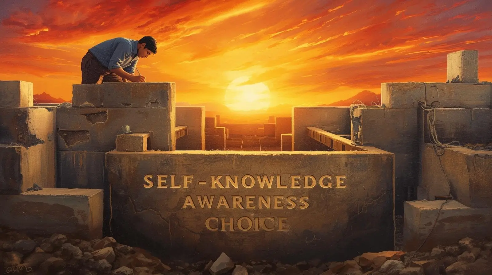

_Originally posted March 6, 2021_

Those who've served significant time in prison have likely learned more about themselves than most people will ever discover about their own natures. You cannot spend decades alone with your thoughts without eventually confronting the demons that lurk in the shadowy corners of your psyche. Each person handles this inevitable reckoning differently — some ignore the uncomfortable truths, others embrace their darker aspects, but the wisest learn from what they discover and use that knowledge as a compass for navigating future challenges.

Early in my sentence, I didn't care much about such introspection. Death in prison seemed inevitable, so I figured I might as well do whatever I wanted while waiting for that outcome. I drank prison wine and used whatever drugs were available, fought whenever provoked, and generally didn't give a damn about learning from my past mistakes. Self-reflection felt like a luxury I couldn't afford when survival demanded constant vigilance.

Fortunately, that destructive phase didn't last long. Something shifted — perhaps maturity, perhaps exhaustion, perhaps the influence of people who cared about my future. I began to recognize that I had something worth preserving, not just in myself but in the relationships that had sustained me through the darkest periods.

## The Decision to Face the Mirror

I made a conscious decision to not only face my demons but to banish them entirely. This proved much easier to declare than to accomplish. The psychological archaeology required to unearth buried traumas, examine destructive patterns, and rebuild healthier responses took years of patient, often painful work.

Over the next two decades, I discovered issues I hadn't even known I possessed. Childhood abandonment had created attachment patterns that sabotaged relationships. Violence had become my default response to frustration because it was the only tool I'd been taught. Rage served as both shield and weapon, protecting me from vulnerability while isolating me from genuine connection.

Learning to combat these ingrained responses without relying on drugs or violence required developing entirely new skill sets. I had to identify the early warning signs of emotional escalation, understand the triggers that activated my worst impulses, and create alternative responses that didn't involve destruction.

## The Tools of Transformation

Prayer, meditation, and creative expression became my primary tools for redirecting negative energy into positive outcomes. Prayer connected me to something larger than my circumstances, providing perspective when problems felt overwhelming. Meditation taught me to observe my thoughts and emotions without being controlled by them. Creative writing, art, and music gave me outlets for processing complex feelings without hurting myself or others.

These practices weren't magic solutions — they required daily commitment and constant refinement. Some days I succeeded in managing my responses appropriately; other days I failed spectacularly. But gradually, the successes began to outnumber the failures, and healthier patterns started to replace destructive ones.

The most crucial realization was that I had choices in how I responded to circumstances. For years, I'd believed that my reactions were automatic, that anger and violence were inevitable responses to certain triggers. Learning that I could pause between stimulus and response — that I could choose my reactions — was perhaps the most liberating discovery of my incarceration.

## The Application in Freedom

Since my release, these hard-won lessons have proven invaluable. The stress associated with reentry after 24 years is genuinely overwhelming. New technology to master, complex social situations to navigate, bureaucratic systems to understand, financial responsibilities to manage — the learning curve is steep and unforgiving.

External expectations compound the internal pressure. Family members want to see rapid progress. Employers expect consistent performance. Society watches for signs of failure or success. The weight of these expectations creates a constant background pressure, like living deep underwater where every movement requires conscious effort.

With proper preparation, this pressure remains manageable. Without it, the stress would be absolutely crushing, leading many returning citizens back to the familiar chaos of criminal behavior and eventual reincarceration.

## The Unexpected Stressors

But it's not the constant pressures that pose the greatest danger — it's the unexpected stressors that emerge without warning. A technical problem that threatens a work deadline. A bureaucratic snafu that jeopardizes housing. A social misunderstanding that strains an important relationship. These sudden challenges have the potential to trigger the old patterns of rage and destructive response.

The difference now is that I recognize these moments for what they are: tests of the emotional skills I developed during incarceration. I can feel the familiar surge of anger, identify the trigger that activated it, and choose a response that solves the problem rather than creating new ones.

This doesn't make the stress disappear or the emotions less intense. But it makes them manageable rather than overwhelming, temporary rather than permanent, challenges rather than crises.

## The Cycle of Recidivism

I fear for those who will be released into the world unprepared for these psychological challenges. The statistics on recidivism exist for a reason — many returning citizens haven't done the internal work necessary to handle the complexities of free-world living.

They haven't identified their triggers or developed healthy coping mechanisms. When stress mounts and emotions spiral out of control, they default to the same patterns that led to their incarceration. The cycle repeats because the underlying issues were never addressed.

Until they face themselves honestly — acknowledging both their potential and their limitations — the cycle cannot be broken. They must learn what situations activate their worst impulses and develop strategies for managing those moments when they arrive.

## The Necessity of Self-Knowledge

This internal work isn't optional for successful reentry — it's the foundation upon which everything else is built. All the job training, housing assistance, and social support in the world won't matter if someone hasn't developed the emotional tools to handle stress without self-destruction.

The process is by no means easy. It requires courage to examine painful truths, honesty to acknowledge personal responsibility, and persistence to practice new responses until they become natural. But it's absolutely necessary for breaking the cycle of incarceration.

## Paying It Forward

Hopefully, I can pass on these lessons through example rather than preaching. Watching someone navigate challenges successfully while maintaining emotional equilibrium provides a more powerful lesson than any lecture about anger management or stress reduction.

My goal is to demonstrate that transformation is possible, that people can change fundamental aspects of their character with sufficient commitment and proper tools. This isn't about perfection — I still struggle with anger, still feel overwhelmed by stress, still default to old patterns occasionally. But I've developed the skills to recognize these moments and course-correct before they lead to destructive outcomes.

## The Universal Application

The advice to "know thyself" isn't limited to the formerly incarcerated community. Everyone faces stressors that trigger unhealthy responses. Everyone has psychological patterns that sabotage their goals and relationships. The tools that work in prison — self-reflection, emotional awareness, alternative response strategies — prove equally valuable in civilian life.

The main difference is urgency. In prison, failing to develop these skills can literally be a matter of life and death. In the free world, the consequences might be lost jobs, damaged relationships, or missed opportunities — serious, but not immediately fatal.

## The Ongoing Journey

Self-knowledge isn't a destination but a continuous process of discovery and refinement. As circumstances change and new challenges emerge, I continue to learn things about myself that surprise me. The key is maintaining the commitment to growth and the willingness to adapt strategies as needed.

The mirror may have been shadowed for many years, but it's gradually becoming clearer. Each challenge successfully navigated, each trigger appropriately managed, each moment of wisdom applied rather than wisdom ignored — they all contribute to a clearer understanding of who I am and who I want to become.

**The ancient Greek maxim "know thyself" remains the most practical advice for anyone seeking to build a life worth living. In prison or in freedom, self-knowledge is the foundation of all other growth.**
