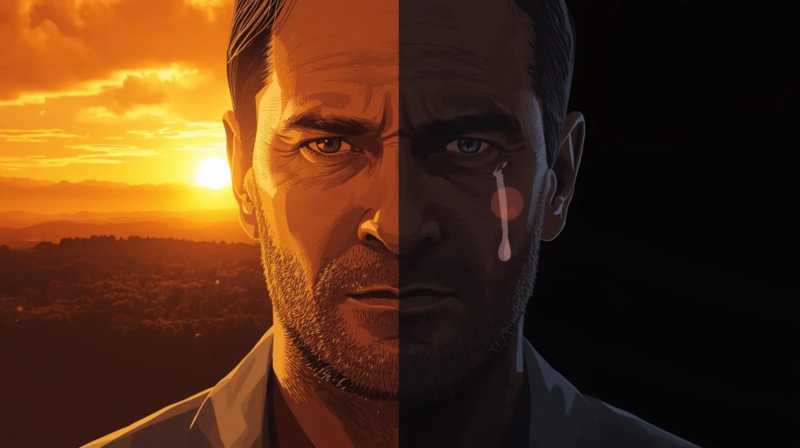

_Originally posted March 20, 2021_

Death and I are old acquaintances. Over 24 years of incarceration, I witnessed it arrive in various forms — the peaceful departures of illness and old age, the sudden violence of murder and suicide, the slow deterioration of those who simply gave up hope. While repeated exposure does make death easier to witness, the cumulative weight of these experiences creates a complex relationship with mortality that shadows every subsequent encounter.

Each glimpse of death somehow cheapens the urgency of my own existence while simultaneously making it more precious. It's an unsettling paradox — becoming both more cavalier about mortality and more desperate to make the remaining time meaningful.

Getting out of prison was supposed to herald a period of joy and celebration. For the most part, it has been exactly that. But I didn't expect to confront death so immediately and frequently during what should have been my honeymoon period with freedom.

## The First Loss

Within two weeks of my release, my grandmother died from COVID-19 complications. The timing felt particularly cruel — she had lived to see me gain my freedom, but we would never get to celebrate that milestone together.

She lived in another state, making visitation impossible even under normal circumstances. My home detention restrictions would have prevented travel anyway. There was some small comfort in knowing she'd received word of my release, that her final days included the knowledge that I'd made it out safely. But we were robbed of the reunion we'd both anticipated for so many years.

The grief was complicated by guilt. Here I was, finally free after 24 years, and instead of pure gratitude I was processing loss. It felt selfish to mourn when I should have been celebrating, ungrateful to focus on what was missing rather than what I'd gained.

## The Closer Blow

Less than two months after my release, death struck much closer to home. My stepmother succumbed to nearly identical circumstances — COVID contracted, complications overwhelming her system, a ventilator that ultimately couldn't save her. She fought courageously for sixteen hours after they removed life support, but in the end, she couldn't overcome the damage.

This loss hit differently because I'd been living with her during my initial weeks of freedom. Every morning, she asked for a hug and told me she loved me — simple gestures that helped bridge the gap between institutional isolation and family connection. Her presence had made the house feel like a real home rather than just another place to sleep.

Now the house feels bigger and emptier without her warmth filling the spaces. Her absence creates echoes where her voice used to be, shadows where her movement used to bring life to ordinary rooms.

## Worrying for the Living

My concern has shifted to my father, who now faces the unimaginable burden of burying his second wife under tragic circumstances. Watching him navigate this grief while trying to maintain stability for my own adjustment creates a complex emotional landscape.

I fear I can only offer limited support. My repeated exposure to death has left me somewhat calloused to the experience — not because I don't care, but because I've learned to process it as an inevitable part of existence rather than a shocking disruption. This perspective, while protective for me, doesn't necessarily provide comfort to someone experiencing fresh grief.

Still, I do what I can to look after him and keep his spirits elevated. He's lived a hard life that has forged tremendous resilience, but even the strongest materials can snap under sufficient pressure. Grief has a way of finding the stress fractures that life has created over time.

## The Cruel Irony

Part of me rebels against this timing. After 24 years of suffering surrounded by misery and death, coming home shouldn't have meant more of the same. I'd envisioned my release as an escape from tragedy, a transition into a period of peace and rebuilding.

The reality is harsher and more complex. Life doesn't pause its natural rhythms to accommodate personal milestones. Death doesn't respect the timing of freedom or the need for celebration. Sometimes the most profound losses occur precisely when we feel most unprepared to handle them.

Yet this harsh lesson contains important wisdom. Life isn't fair — not just within prison walls, but everywhere. Bad things happen to good people regardless of their circumstances, their deserving, or their timing. Sometimes all we can do is support each other through the inevitable difficulties.

## The Perspective of Mortality

This early confrontation with death has provided unexpected perspective on the preciousness of life and the urgency of making meaningful choices. When you've seen how quickly and unexpectedly life can end, the luxury of procrastination or taking relationships for granted becomes unaffordable.

Every conversation with family members now carries additional weight. Every moment of connection feels more valuable because I understand how easily it could be the last. This isn't morbid obsession — it's practical wisdom about prioritizing what truly matters.

The time we have here is limited and comes with no guarantees about quality or duration. This knowledge should drive us to treat each other with greater kindness, to express love while we can, to resolve conflicts before they become permanent regrets.

## The Burden of Unfinished Business

Death serves as a stark reminder about the importance of living without regret. When relationships end through death rather than choice, there's no opportunity to apologize for harsh words, to express love that went unspoken, or to resolve misunderstandings that seemed less urgent when time felt infinite.

I've witnessed too many people carry the weight of things left unsaid, apologies never offered, forgiveness never requested. This burden can be crushing, particularly when the window for resolution has permanently closed.

Trust me — carrying that weight of unfinished emotional business creates a form of suffering that makes all other difficulties pale in comparison. It's a burden I wouldn't wish on anyone.

## Life as Sacred Urgency

Rather than allowing these early losses to darken my newfound freedom, I'm choosing to let them illuminate the sacred urgency of being alive. Every day above ground is a gift, every relationship an opportunity, every moment of connection a small miracle that shouldn't be wasted.

This doesn't mean living in frantic desperation or treating every interaction as potentially final. Instead, it means bringing intentionality to my choices, authenticity to my relationships, and gratitude to my daily experience.

## The Dual Truth

Death teaches us two seemingly contradictory lessons simultaneously: life is precious and life is fragile. We must value what we have while accepting that it won't last forever. We must love deeply while understanding that loss is inevitable.

Holding both truths simultaneously creates a kind of bittersweet wisdom that deepens rather than diminishes the experience of being alive. It makes joy more poignant, connection more meaningful, and time more sacred.

## Moving Forward with Wisdom

These early encounters with death during my reentry haven't derailed my progress or dimmed my gratitude for freedom. Instead, they've added layers of meaning to every subsequent experience. They've reminded me that freedom and life itself are temporary gifts that deserve respect and intentional use.

I'm learning to carry grief and joy simultaneously, to mourn losses while celebrating gains, to honor the dead while fully embracing life. This emotional complexity feels more authentic than simple happiness — more honest about the full spectrum of human experience.

## The Teacher's Final Lesson

Death, it turns out, is one of life's most effective teachers. It strips away illusions about permanence, clarifies priorities with brutal efficiency, and demands that we grapple with what truly matters. While I wouldn't have chosen these lessons so early in my freedom, I'm grateful for the wisdom they've provided.

**Memento mori — remember you must die. Not as a morbid obsession, but as a daily reminder to live fully, love completely, and make every moment count. The mirror may be shadowed by loss, but it's also illuminated by the preciousness of whatever time remains.**
