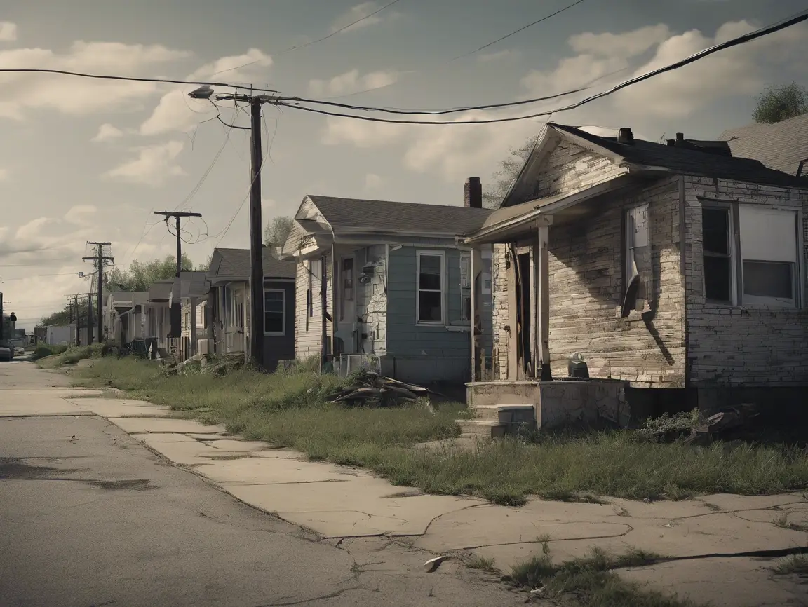

## Unveiling the Challenges of Returning Citizens

I’ve traversed the majestic peaks of Mount Jefferson, breathed the crisp air of Oregon’s wilderness, and felt the expansive freedom that only nature can offer. On RC Journey, I celebrate these moments of awe and the profound sense of liberation they inspire. Yet, as the sun sets over a breathtaking vista, a different, often-hidden landscape emerges – the terrain of **Reentry Realities**: Challenges of Returning Citizens.

This section of RC Journey is dedicated to shedding light on the often-harsh truths that lie just beneath the surface of America’s natural splendor. While the mountains stand tall and the forests whisper tales of resilience, the path for returning citizens, like myself, is frequently fraught with systemic barriers, profound personal struggles, and an unwavering need for resilience to rebuild a life.

It's the "ugly truth," if you will. It's the reality that the moment a person walks out of prison, the journey of true freedom is often just beginning, and it’s rarely a smooth road. The societal narratives around incarceration often end at release, as if the story concludes there. But for hundreds of thousands of individuals each year, that’s precisely when the most challenging chapter begins.

## The Core Pillars of Reintegration

Consider the fundamental pillars of a stable life: housing, employment, and connection. For most, these are basic needs; they can become insurmountable challenges for returning citizens.

- **The Labyrinth of Housing:** Imagine stepping out of confinement with nowhere to go. Many face immediate homelessness or reliance on temporary, often unstable, solutions. The complexities range from discrimination by landlords, restrictive policies in public housing, and the sheer scarcity of affordable options. Finding a stable roof over one's head isn't just about shelter; it's the foundation for everything else that follows. Without it, the odds are stacked impossibly high.

- **The Employment Paradox:** Securing meaningful work is vital for dignity, independence, and preventing recidivism. Yet, the dreaded "box" on job applications, background checks, and the pervasive stigma attached to a criminal record often slam doors shut before a conversation can even begin. Many returning citizens are highly motivated and possess valuable skills, yet they are funneled into low-wage, unstable jobs, or face outright rejection, regardless of their qualifications or commitment to change.

- **Navigating Personal Relationships:** Beyond the practicalities, there’s the deeply personal terrain of relationships. Reconnecting with family, rebuilding trust, and navigating the complexities of friendships and romantic partnerships after years of separation and trauma is incredibly difficult. The societal judgment can extend to loved ones, isolating returning citizens further at a time when support systems are most critical. Finding genuine connection, and even love, becomes an act of profound courage and vulnerability.

## My Commitment: Understanding and Action

This is the landscape explored in "Reentry Realities." I will delve into these topics, not with despair, but with an honest, unvarnished look at the challenges. I'll examine the policies that hinder progress, the societal attitudes that perpetuate stigma, and the daily grind of overcoming obstacle after obstacle.

But this isn't just a place to lament the difficulties. It's also a testament to the incredible resilience of the human spirit. It's about acknowledging the strength required to persevere, to adapt, and to continuously seek a path forward even when the way is unclear. My own journey, from the confines of incarceration to my role as a Platform Systems Engineer for The Last Mile, is just one example of this resilience in action. Here, I will share my experiences and invite you to truly see the complexities faced by so many.

As I continue my RC Journey across America's awe-inspiring landscapes, remember that every breathtaking view serves as a powerful contrast to the often-invisible struggles unfolding in communities across the nation. This section is about understanding that struggle, fostering empathy, and hopefully, inspiring action towards a more equitable path for all returning citizens. Join me as I pull back the curtain and explore the unseen landscape of reentry – raw, challenging, yet ultimately, a testament to the enduring power of hope and the human will to thrive.
