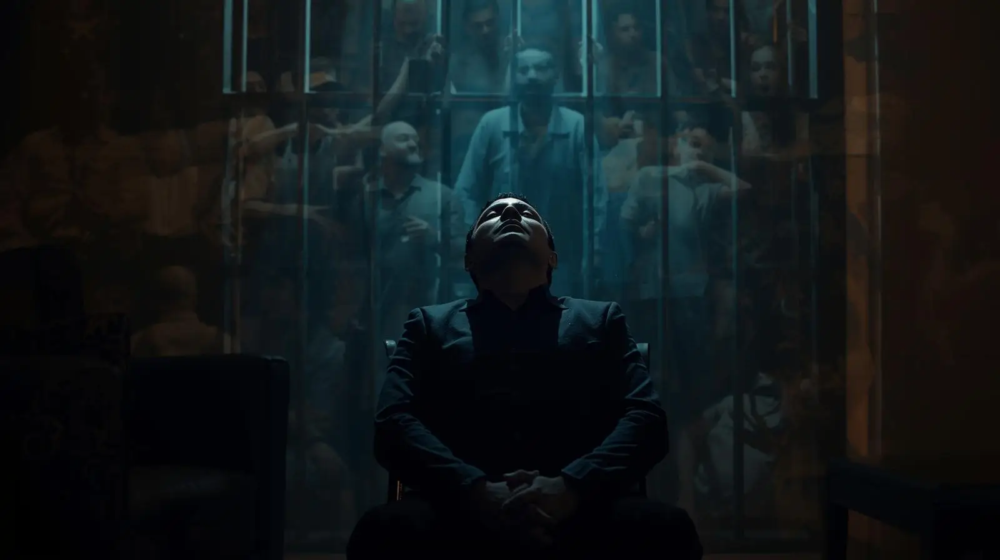

**_Originally posted February 6, 2021_**

I never imagined that silence could be so thunderously loud. For 24 years, I longed for quiet moments and solitude with the desperation of a drowning man gasping for air. Now that I finally possess these treasures, I cherish them above all else — and I must seem deeply antisocial to those around me.

I spend more time alone than with family or friends, disappearing into my room for hours with nothing but my computer and phone for company. While I'm certain they understand intellectually, I doubt anyone in my life can truly grasp just how essential this solitude has become to my psychological survival.

## The Weight of Constant Observation

For nearly a quarter-century, I was never more than a few feet from another human being. Always someone watching, always someone there, always another soul breathing the same recycled air within arm's reach. The concept of privacy became an abstract memory, like trying to recall the taste of a childhood candy.

Living under constant observation fundamentally altered my relationship with the world. Privacy wasn't just absent — it was a luxury I'd forgotten how to want. Every movement, every expression, every moment of vulnerability was potentially visible to dozens of eyes. You learn to live in a state of perpetual performance, never fully relaxing into authenticity.

Now that I have the opportunity, I spend vast stretches of my free time completely alone. I retreat to my room, close the door, and exist in a space where no one can see me. The simple act of working on my computer or scrolling through my phone without an audience feels revolutionary.

## The Paradox of Virtual Connection

My job requires virtual meetings throughout the week with colleagues who are two thousand miles away. The irony isn't lost on me — after years of craving human contact, I'm now conducting my most meaningful professional relationships through screens. Yet these digital interactions provide exactly what I need: connection without proximity, engagement without intrusion.

Though I enjoy being alone, these virtual relationships ensure I'm not lonely. The distinction may seem semantic, but I assure you the difference is profound. Solitude is a choice; loneliness is an imposition. I'm finally able to choose when and how I connect with others, a form of agency that feels almost magical after decades without it.

## The Cacophony of Incarceration

Prison is never truly quiet. Even during supposed "quiet hours," the environment hums with a constant symphony of institutional noise. Guards and inmates engage in perpetual vocal exchanges — shouting orders, arguing, negotiating the endless small dramas of confined life. The intercom system punctuates every hour with announcements, reminders, and warnings.

Recreational activities add their own soundtrack: dominoes slamming against metal tables with gunshot-like cracks, men yelling and clapping at televised games, radios competing with conversations in multiple languages. The cacophony can become genuinely deafening, a wall of sound that penetrates even your dreams.

But beyond the obvious noise lies a subtler acoustic pollution that becomes part of your baseline existence. Guards' radios crackle constantly with coded communications. Keys jingle with every step, creating a percussion that never quite stops. Ventilation systems and industrial fans run continuously, producing a white noise that becomes as constant as your own heartbeat.

True silence simply doesn't exist in that environment. Your nervous system adapts to the constant auditory assault, developing a kind of selective deafness that allows basic function but never permits genuine rest.

## Sacred Hours

My favorite times now are the late evening and early morning hours, when the world settles into something approaching actual quiet. This old house, weighted with memory and history, seems to exhale during these periods. The settling sounds — creaks, groans, the whisper of wind through old windows — have become my evening prayer.

Every footstep from my father or stepmother registers clearly now, each passing car draws my attention, each settling sound of the house speaks to me. Some might find these noises unsettling, evidence of how exposed and vulnerable we are even in our supposed sanctuaries. Instead, I find them deeply comforting.

These are the sounds of freedom. They represent the ordinary rhythms of domestic life that I'd been denied for most of my adult existence. The creak of floorboards means I'm in a real home, not an institutional dormitory. The sound of traffic means I'm connected to a larger world of movement and possibility.

## Professional Silence

My first week at my new job was marked largely by intentional quiet. I attended meetings where I mostly listened, absorbing the knowledge and expertise of colleagues who possessed decades more experience. Their acceptance and kindness provided a refreshing contrast to the cynicism and suspicion that permeated prison culture.

More than once during that first week, I was moved profoundly by simple displays of professional respect and human decency. Colleagues asked for my opinions, included me in discussions, treated me as a valued team member rather than a curiosity or charity case. The basic dignity of being heard and respected felt almost overwhelming in its novelty.

This workplace respect represents something I'd almost forgotten existed: the possibility of being valued for my contributions rather than managed as a potential threat. Every meeting reinforced that I had something meaningful to offer beyond my story of redemption.

## The Armor's Weight

Compliments continue to challenge me. I appreciate them deeply but struggle with appropriate responses, often defaulting to silence rather than risking awkward exchanges. The psychological armor that kept me safe in prison still weighs heavily on my shoulders, and while I'm beginning to shed some pieces, many remain stubbornly in place.

I'm not certain I should remove all of it. Survival in prison required sophisticated emotional defenses, and some of those skills may prove valuable in the free world as well. The challenge lies in learning when armor is necessary and when it becomes a barrier to genuine connection.

The instinct to protect myself runs deeper than conscious thought. It's been trained into my responses by years of necessity, reinforced by countless situations where vulnerability meant danger. Unlearning these patterns will take time and patience — with myself and from others.

## The Settling Process

As the initial turmoil of freedom gradually subsides into something approaching routine, I can feel subtle changes beginning to emerge. The desperate need for absolute solitude is slowly giving way to curiosity about broader social connection. I'm starting to imagine spending more time with family and friends, though I'm not yet ready to act on these impulses.

This transition feels organic rather than forced, like the natural settling of sediment in still water. Push too hard and everything becomes cloudy again. Allow the process to unfold naturally, and clarity gradually emerges.

I suspect that eventually I'll want to make more noise in the world, to engage more actively with the community around me. For now, however, I'm content to embrace the silence as I transform into whoever I'm becoming next.

## The Sound of Becoming

Silence, I'm learning, isn't empty space — it's pregnant with possibility. In the quiet hours, away from the expectations and observations of others, I'm free to discover who I am when no one is watching. This process of self-discovery requires the kind of deep introspection that's impossible amid constant noise and stimulation.

The person emerging from these silent hours feels familiar yet transformed. He carries the wisdom earned through decades of hardship but isn't defined by those experiences. He possesses the strength forged in adversity but isn't constrained by the limitations that survival once required.

All I have to do is be still and let this transformation happen. In the silence, between the settling sounds of an old house and the distant hum of a world that kept spinning without me, I'm learning to become fully human again.

**The mirror may still be shadowed, but in the silence, I can finally hear the sound of my own authentic voice.**
