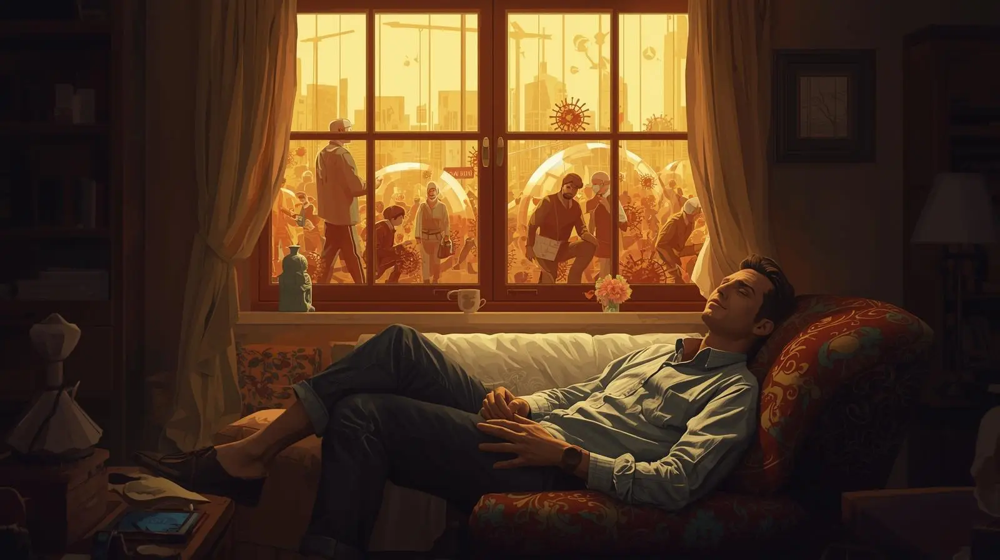

_Originally posted February 27, 2021_

Those who came before me insisted I'd eventually forget about prison, that time would soften the edges of institutional memory until it felt like someone else's nightmare. Those people, with all due respect, are completely wrong. I'm constantly reminded of my incarceration — not through traumatic flashbacks, but through the practical lens that 24 years of confinement creates.

Every situation I encounter gets filtered through a prisoner's perspective. I adapt to circumstances by defaulting to the ingenuity and resourcefulness that institutional life demanded. When faced with limitations or obstacles, I instinctively look for creative solutions using whatever materials are available. This isn't trauma response — it's practical wisdom that I consider an asset rather than a liability.

## The Shutdown Skills Gap

Recent experiences have revealed that most people lack this adaptability. When removed from their comfort zones or faced with significant restrictions, they tend to shut down rather than pivot. They become paralyzed by indecision instead of viewing obstacles as puzzles to solve.

Prison taught me that difficult situations are challenges to overcome and opportunities to exercise creativity. Over the years, I witnessed ingenious solutions to seemingly impossible problems, often using the most unlikely materials and methods. Necessity truly is the mother of invention, and necessity was our constant companion.

This perspective has proven invaluable during my reentry, particularly as I navigate the intersection of personal freedom with ongoing pandemic restrictions.

## Pandemic as Prison

The COVID-19 pandemic has profoundly affected most people's daily lives, limiting their movement, restricting their social interactions, and forcing them into smaller, more controlled environments. For many, these limitations feel oppressive and unnatural. They struggle with the psychological weight of confinement, the loss of routine freedoms, and the uncertainty about when normal life will resume.

For me, these restrictions barely register as hardship. Compared to where I've been, pandemic limitations feel almost luxurious. I have privacy, choice, entertainment, communication with the outside world, and the ability to move freely within my environment. These "restrictions" pale in comparison to actual incarceration.

Additionally, being on home detention makes the broader social isolation feel natural rather than imposed. While others chafe against stay-at-home orders, I'm already adapting to a limited radius of movement. The psychological adjustment feels seamless because it's merely a less restrictive version of what I've already mastered.

## Unexpected Advantages

The pandemic has created an unexpectedly favorable environment for my reintegration into society. Instead of standing out as someone with limited social experience, I'm joining a world where everyone's social skills have atrophied somewhat. The playing field has been leveled in ways that make my transition less conspicuous.

Remote work, which might have seemed isolating to someone accustomed to office environments, feels like a gift. I can contribute professionally without navigating complex workplace social dynamics while I'm still developing those skills. Video meetings replace face-to-face interactions in ways that feel comfortable and manageable.

The slower pace of social life also provides breathing room for gradual adaptation. Instead of being thrust into a fully active social environment, I'm emerging into a world that has collectively slowed down, giving me time to develop relationships and social confidence at a sustainable pace.

## Collective Empathy

Perhaps most importantly, the pandemic has given everyone a taste of restricted freedom. People who never experienced anything beyond ordinary limitations now understand, at least partially, what it feels like to have movement curtailed and choices constrained.

This shared experience of limitation has created unexpected empathy for my situation. When I explain the challenges of reentry or the adjustments required after long-term incarceration, people nod with recognition rather than blank incomprehension. They've felt confined, isolated, and eager for normal life to resume.

The collective trauma of pandemic restrictions has also highlighted the importance of mental health, adaptability, and creative problem-solving — all skills that prison taught me in abundance. Instead of being seen as someone damaged by institutional life, I'm increasingly recognized as someone who developed useful survival skills.

## Learning from Limitation

The pandemic has taught many people lessons that incarcerated individuals learn by necessity: how to find entertainment with limited resources, how to maintain relationships through restricted communication, how to stay mentally healthy in confined spaces, and how to adapt expectations to match available possibilities.

Watching friends and family discover these skills has been both validating and encouraging. It confirms that the adaptations I made weren't signs of institutional damage but examples of human resilience under pressure. Everyone is capable of these adjustments; some of us just had earlier and more intensive opportunities to develop them.

## The Long View

While I hope the pandemic's worst effects will soon be behind us, I'm grateful for the timing of my release. Emerging into a world that had temporarily joined me in various forms of confinement has made the transition gentler than it might have been otherwise.

The shared experience of limitation has also reinforced important truths about human adaptability and the value of perspective. What feels unbearable in the moment often becomes manageable with time and the right mindset. The skills required for psychological survival in difficult circumstances — creativity, patience, gratitude for small pleasures — serve us well in all areas of life.

## Building on Shared Experience

My hope is that the pandemic's lessons will outlast its restrictions. If people remember what they learned about resilience, creativity, and the importance of human connection during this period, they might carry more empathy for those who face ongoing limitations.

The formerly incarcerated community has always understood that freedom is relative and that adaptation is essential. Now that understanding is more widely shared, creating opportunities for connection and mutual support that didn't exist before.

## Perspective as Gift

Rather than viewing my institutional experience as purely negative, I'm learning to recognize the practical gifts it provided. The ability to find contentment in restricted circumstances, to solve problems with limited resources, and to maintain hope through extended difficulties — these aren't just survival skills, they're life skills that serve well in any circumstance.

The pandemic didn't break me because I'd already been broken and rebuilt. The limitations didn't overwhelm me because I'd learned to thrive within much tighter constraints. Instead of being a victim of circumstance, I became a guide for others learning to navigate unexpected restrictions.

## Moving Forward Together

As society gradually reopens and returns to normal patterns, I hope we'll retain some of the empathy and adaptability that shared limitation created. The experience of collective confinement, however temporary and partial, has provided a bridge of understanding that benefits everyone.

For returning citizens, this moment represents an unprecedented opportunity to be seen as resources rather than burdens, as people with valuable experience rather than damaged goods. The world has temporarily joined us in learning to be resilient, creative, and grateful for freedom — and that shared experience creates possibilities for connection that didn't exist before.

**Sometimes the best preparation for freedom is learning to thrive in confinement. The pandemic taught everyone what some of us already knew: limitation can be a teacher, and adaptation is a superpower.**
