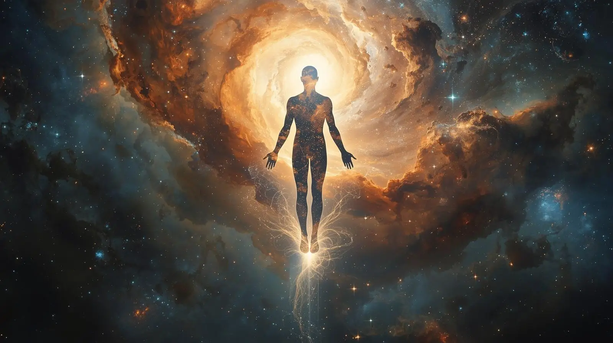

## Introduction

What if humanity's ultimate destiny lies not in technological advancement alone, but in transcending our physical form entirely? This essay explores a radical possibility: that our species may be evolving toward a state of pure sentient energy — what I call "ascendancy" — a form of existence that would fundamentally redefine our understanding of consciousness, reality, and our relationship with the divine.

It is the nature of reality to evolve, and as we continue to understand the particulars of our own moment of existence, the very nature of reality changes to include what we now estimate is possible based on this new comprehension. The _imminent now_ alters the possible future.

## The Nature of Reality and Mind

All things originate in the mind. All of creation begins first with an idea. Is the mind an effect of a prior materialistic cycle? Must there have been a creation? A beginning? If not, then from what did we initially evolve?

It is conceivable that ascendancy represents the inevitable horizon for the human race. It contains the potential to replace religion, perhaps, but not the concept of a God. Our evolutionary journey began with tremendous energy. Everything we are is driven by energy. So, too, must one of our stages of _being_ be that of energy itself.

This is the cycle of our understanding: the force which composes what I term "the Ascendant" is the perfect mind-body relationship. The Ascendant is a being of pure mind, unencumbered by physical limitations.

## The Path to Ascendancy

Energy is the root of all existence. The mind is processed through a form of energy, and understanding this fundamental truth may allow us to manipulate that energy to affect other areas of reality. "Expand your mind" becomes more than metaphor for the Ascendant — it is literal instruction for evolutionary development.

The path follows three essential steps: believing is the first, knowing is the second, and practice until attainment is the third. Discipline serves as the key to sustained practice. This represents a lifelong commitment, perhaps requiring generations to manifest any meaningful evolutionary progress. It demands leaving behind physical desires and mental anchors that tether us to our current limitations.

On its most fundamental level, ascendancy describes the state in which we evolve into beings of sentient energy. To reach this purely energetic state, however, we must comprehend the nature of such forces with perfect clarity. We must learn to follow natural laws and move in perfect synchronicity with their rhythms.

These natural laws extend far beyond earthly or celestial patterns. They are not limited to seasonal, solar, or lunar cycles. The natural laws are universal, influencing the natural order that permeates and controls all of existence — from the microcosmic world of quantum realities to the macrocosmic realm of the multiverse itself. These laws also govern transient, coterminal, and coexistent realities beyond the material realm with which we are familiar. To achieve ascendancy, we must learn to empathize with the forces at play in all dimensions of reality.

## The Source and the Path of Knowledge

To achieve this understanding, we must grasp how all existence functions in order to unify ourselves with its fundamental patterns. All aspects of "what is" must be comprehended. By learning how reality operates, we become attuned to its rhythms, unveiling powerful insights that remain hidden in plain sight. The answers to our world surround us constantly, yet we regularly fail to perceive them.

Knowledge and understanding serve as twin keys to ascendancy, both individually and collectively. However, knowledge without understanding proves pointless to the Ascendant's pursuits. Both must advance together to become truly reciprocal — after all, knowledge without understanding is merely memory.

We must open ourselves to what I call the Source — the primeval state of existence from which everything we know originated. We should never fight what comes naturally to us, yet our aims consistently seem opposed to the natural order. We form attachments to physical objects that represent no lasting value, and to ephemeral concepts like spontaneous emotion that prove more detrimental than beneficial. Our primary attachment should be to knowledge of all realities that surround us. In this pursuit, we will find our answers and our true place in the cosmic order.

Deep contemplation and meditation prove critical for understanding these transcendental concepts. Each time we delve into our grasp of existence's nature, new insights emerge. Evolution serves as the gateway to ascendancy, making this a deliberately slow process by our limited understanding of time. Numerous stages likely exist between our current state and the higher levels of attainment we might achieve. With each incremental step our species takes, our mental advancement must increase correspondingly.

## The Paradox of Knowledge

Knowledge drives the advancement of our species and serves as evolution's primary force. The more we know, the more proficient we become at influencing our existence and its conditions. Yet knowledge contains a fundamental irony: the more we learn, the more we realize remains unknown. This truth intensifies exponentially with each new discovery.

Complete knowledge appears impossible because one uncertainty must always persist — the uncertainty of whether we truly know all there is to know. Absolute knowledge invites absolute doubt. Paradoxically, if knowledge were finite, we might eventually know so much that we effectively know nothing. Complete oblivion becomes the true apex of knowledge.

Therefore, our goal is to know all that we can understand, recognizing that infinite knowledge exists beyond our current grasp. This understanding leads us to examine the roles of science and religion in our evolutionary journey.

## Science, Religion, and the Synthesis of Truth

Science has long challenged religion by dismantling backwards religious presumptions. Much of what was once considered mystical has been explained and quantified through empirical evidence and logical analysis. This suggests that science could potentially replace religion's traditional role. The physical laws governing our existence might represent the divine manifestation of ultimate truth.

Ascendancy offers a path toward becoming truth itself — governing universal laws rather than being governed by them. This completes a philosophical circle by transcending science as we currently understand it, giving birth to a new domain of metaphysics where religion and science become symbiotic rather than opposed.

This synthesis moves us into the nonphysical realms of mind and spirit, which are completely coexistent and inseparable. The physical body becomes merely instrumental — a temporary vessel rather than our ultimate destination. While death may offer one form of ending, it does not represent the culmination of our evolutionary journey. All answers can be discovered through the sustained application of determination and time.

## String Theory and the Voice of Creation

String theory, despite its mathematical complexity, essentially proposes that all existence emerges from the vibrations of infinitely thin "strings." While this explanation oversimplifies an intricate theoretical framework, it raises profound questions: Are these fundamental vibrations the voice of God? Or do they represent evidence of some deeper truth waiting to be discovered — assuming such truth exists beyond the concept of divinity itself?

## Creational Intelligence and Our Place in the Cosmos

If creational intelligence exists, we might remain entirely unknown to it. We could be nothing more than a byproduct of original nature — an incidental evolution of creation itself. Perhaps this Intelligence seeks the truth of its own existence, with humanity representing only a submicroscopic aspect of that vast inquiry. Galaxies, or even entire universes, might relate to such intelligence as atoms relate to us.

This perspective raises disturbing questions: Is our creation accidental? Are we merely a side-effect of something immeasurably more significant than our human-centered concept of deity? Perhaps Creation itself represents the only meaningful Power within our reality.

Creational intelligence, if it exists, would be _infinitely existent_ — always remaining beyond our capacity to conceive. If we could fully understand it, then something must have created our understanding, leaving us unable to comprehend _how_ we understand. The creational intelligence would thus remain forever outside our intellectual grasp.

This suggests infinite layers of existence awaiting discovery: multiple dimensions, parallel realities, spacetime bridges, and countless other phenomena. Each layer conceals additional layers beneath it. As we grasp each new concept, our species evolves again, developing greater ability to influence reality. This progression raises the fundamental question: Do we create and dictate our reality, or does reality create and dictate us?

## The Ultimate Paradox

While this may seem infinitely recursive, it's possible that some energy-sentient state exists wherein ascended beings obtain complete knowledge. If knowledge provides the path to transcendence, then the final state would require the completion of all knowledge. The "infinitely existent" might not remain beyond our eventual grasp.

Yet we encounter our familiar paradox once more: the more we learn, the more we realize how little we have learned. At our evolutionary pinnacle, we may effectively know nothing, understand nothing, and precisely then achieve ascension.

This doesn't negate God's existence. Rather, it implies that god-like intelligence, if it exists, remains completely beyond our current ability to comprehend. Such intelligence would far exceed the limited descriptions and narrow perspectives we've assigned through religious ritual. Human conceit leads us to believe that such extraordinary Power focuses primarily on our wellbeing, ignoring the near-infinite number of greater considerations that must occupy divine attention.

## The Relativity of Divinity

Ascendancy offers humanity a path toward achieving, by our limited standards, a divine state. What worlds might we have created without our knowledge? The concept of "god" proves purely relative. Do creatures incapable of comprehending existence on our scale consider us divine? If we discovered life forms beneath the quantum realm, would they perceive us as deities?

Would such cycles of relative divinity ever end? These questions resist easy answers, but they deserve our sustained contemplation as we consider humanity's ultimate evolutionary potential.
