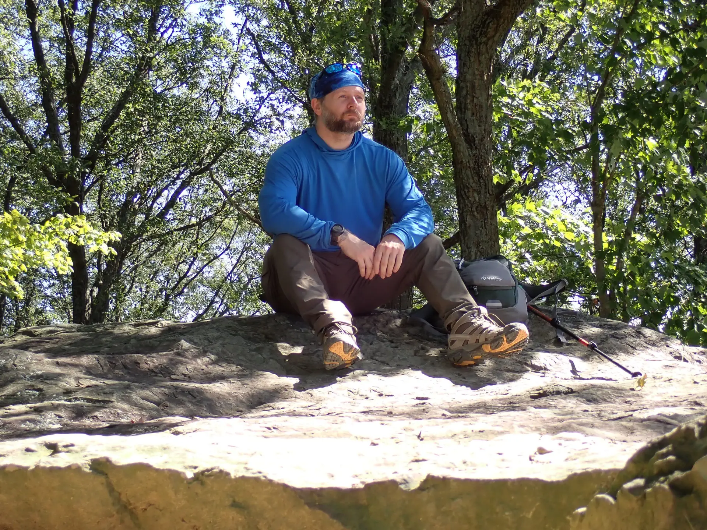

### **The Relentless Pace of Reentry**

Stepping out of prison after so many years, there’s a powerful, almost primal urge that takes hold: the constant need to keep moving. It’s like an internal clock, long dormant, has suddenly sped up, demanding that every moment be filled, every opportunity seized, every experience lived. There’s so much lost time to make up for, so many chapters missed, so many advancements in the world to catch up on. This relentless internal drive is a hallmark of the **making up for lost time** reentry experience.

It’s a peculiar feeling, this need for constant motion. I find myself rushing to get things done, planning the next step before the current one is even finished. If I'm stagnant for too long, if there's a lull in activity, a profound restlessness begins to bother me. It’s a discomfort, an anxiety that whispers: "You're wasting time. You have to move. You have to catch up."

### **Forged in Stagnation: The Prison Paradox**

This urgency isn't random; it's forged in the paradox of incarceration itself. Inside, time can feel agonizingly slow, each day a grinding repetition. There’s a forced slowness to everything, a perpetual waiting. Yet, beneath that enforced stagnation, there’s a furious mental planning. You visualize the outside, strategize for freedom, and meticulously map out all you'll do when you get out. That future becomes a reservoir of suppressed energy. The moment the gate opens, that reservoir bursts, propelling you forward with an intensity born of years of waiting. This is the origin of the powerful drive for making up for lost time during reentry.

### **The Endless To-Do List of Freedom**

The sheer volume of things to get caught up on after so many years away is staggering. From learning new technology that changed the world while you were gone, to understanding shifting social norms, to simply experiencing the simple joys like choosing your own groceries or walking freely in a park – every aspect of life is new again. This creates an endless mental "to-do list" of experiences to reclaim, skills to acquire, and connections to rebuild. This inherent pressure contributes to the feeling of needing to expedite the making up for lost time during reentry.

This constant drive makes it incredibly difficult to remember to slow down sometimes and actually enjoy life. The simple act of relaxation can feel like a betrayal of the past, a squandering of the precious freedom gained. There’s a persistent feeling that every second not spent moving forward, learning, or achieving is a second lost all over again.

### **Embracing the Present Moment**

Acknowledging this deep-seated urge is the first step. It’s a testament to the **returning citizen's** resilience and determination, a powerful engine for success. However, the true challenge lies in finding a new rhythm – one that honors the desire to make the most of every moment, but also allows for peace, reflection, and the simple enjoyment of the present.

The **making up for lost time** reentry experience is a race against an invisible clock. It's a journey not just of outer progress, but of inner balance. It means consciously choosing to pause, to breathe, and to appreciate the freedom of stillness, understanding that true liberation includes the freedom to simply _be_, without the relentless pressure to constantly move forward. Finding that balance is part of defining a truly successful life after prison.
