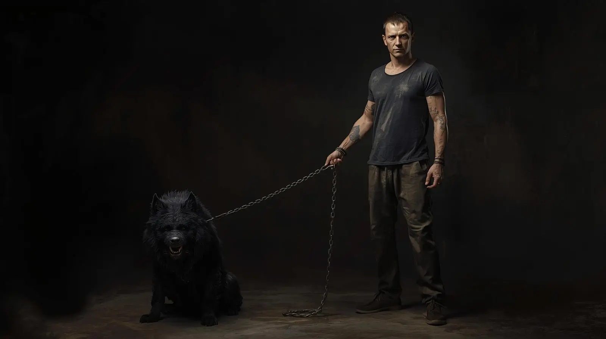

## Introduction: An Intimate Acquaintance

Violence. I know it intimately — not as an abstract concept or distant horror, but as a constant companion that has shaped every stage of my existence. My body tells the story through tough skin and accumulated scars, some inflicted by others, others by my own desperate hand.   A bullet through the leg. Knives to my body. Razors to my flesh. Burns to my skin. Fists to my face. The weapons varied wildly — ball bats, wooden spoons, suitcases, frying pans, bags of frozen peas. I have been beaten with them all, each leaving its mark on both flesh and psyche.   Is it any wonder, then, that I eventually committed the ultimate act of violence? This is not a confession seeking absolution, but an examination of how violence breeds violence, how trauma creates trauma, and how — perhaps — the cycle might finally be broken.  

## The Family Foundation: Learning Violence at Home

My adopted parents were capable of extraordinary savagery toward one another, particularly as their marriage disintegrated. They grew to hate each other with an intensity I have yet to see matched. Physical and emotional violence became their primary language of communication.   My mom bit my dad so deeply it drew blood — he bears that scar to this day. So do I, it would seem. My dad once put one of my mom's friends through the dining room wall, leaving a body-shaped impression in the plaster like something from a twisted cartoon. I never learned what provoked this explosion, but I remember staring at that human-shaped dent frequently in the weeks that followed, trying to comprehend the forces that could drive someone to such violence.   After the divorce, the violence didn't diminish — it intensified and focused increasingly on me. Ironically, the only cooperation I witnessed between my parents involved my punishment. My mom would call my dad specifically to come over and beat me, the one activity that still brought them together.   I remember him breaking an oak paddle over my body once, leaving me gasping for air between sobs. Even worse was my mom's friend who lived with us temporarily — she would beat me with a belt across my back and the backs of my thighs, striking areas that would be hidden by clothing. The calculated nature of that cruelty still disturbs me.  

## First Encounters with External Violence

Violence had been contained within my family until I witnessed its broader reach through a friend's devastating loss. Two women were shot by one of their husbands — one survived despite being shot in the face, while the other, my friend's mother, was killed.   I was somewhere between seven and nine years old, too young to fully comprehend the details or circumstances, but old enough to understand the finality at the funeral. My friend had become like a ghost, hollowed out by sudden, senseless loss. I couldn't fathom losing my mother so violently at that age. The unfairness of it left me with my first real understanding that violence could reach anyone, anywhere.  

## The Escalating Pattern

As I grew older, domestic violence became routine rather than exceptional. My mother's mental health deteriorated, eventually earning diagnoses of bipolar disorder with intermittent explosive episodes. She would attack me savagely for no apparent reason, then apologize profusely and be laughing moments later, as if nothing had happened.   During these episodes, she would lash out with whatever object was within reach, creating an unusual arsenal of weapons. That bag of frozen peas remains the most absurd instrument of violence I've ever encountered — but the absurdity didn't diminish the pain or the psychological impact of unpredictable brutality.  

## The Birth of Rage

Inevitably, the violence absorbed from my environment began to gestate within me, giving birth to what I have always called my **_Rage_**. I capitalize the word because I came to think of it as its own entity — a beast that demanded respect and required careful management.   In the earliest days, I had no control over it. The Rage would rise and consume me completely, shaking my entire body with its intensity. I have hundreds of scars where I inflicted wounds on myself in desperate attempts to appease it. Blood and pain were the only offerings that seemed to provide temporary satisfaction. I cut myself with razors, knives, glass — whatever sharp objects I could find. I burned myself with heated metal. I beat myself with objects and even my own fists. Sometimes even this self-directed violence wasn't enough to quiet the beast.  

## Seeking Alternative Outlets

Drugs provided temporary relief. Altering my reality offered respite from the constant internal pressure, but even chemical escape couldn't keep the Rage permanently at bay. In the end, violence remained the only thing that truly satisfied it.   Fortunately, it was the 1990s, and I discovered an outlet that felt almost socially acceptable: moshing. I attended concerts and raves specifically to join the mosh pits, throwing myself into violent whirlwinds of organized chaos. I would emerge bloody and bruised, unable to move without pain the following day, but these sessions provided the release I desperately needed.   Moshing became my best alternative to more destructive forms of violence — a way to feed the Rage without causing lasting harm to myself or others.  

## The Defining Moment: Witness to Evil

At sixteen, I witnessed an act of pure malevolence that fundamentally altered my relationship with violence forever. I was staying in a trailer with people I considered friends when they brought home a young woman, got her intoxicated and drugged, then raped her. They invited me to participate.   Even with all the violence I had witnessed and endured, nothing had prepared me for that night. I refused to join them but couldn't stop them either — I was outnumbered and stood alone against multiple attackers. I managed to get her out of there as quickly as possible, terrified they might kill her if they decided on another assault.   I have never felt shame as profound as what I experienced that night. The weight of that shame remains with me today, not because I participated, but because I couldn't prevent it. I felt complicit through my inability to stop it.  

## The Vow and Its Consequences

That night, I made a vow that would ultimately destroy my life: I would never again stand idle in the face of evil, regardless of the personal cost. I promised myself I would bring violence to those who deserved it — to those who used it against the undeserving.   This philosophy still resonates with me in certain ways. I will always protect those who cannot protect themselves. Unfortunately, this vow contributed directly to my incarceration. The violence that landed me in prison resulted from my attempt to punish someone I believed deserved it and protect my family — however misguided my actions proved to be.   What I didn't understand then was that I had been manipulated into the hatred I felt. Only with decades of reflection have I come to understand a crucial truth: justice cannot be served through hatred and rage. Violence may sometimes be necessary, but it should never be driven by anger or personal vendetta.  

## Prison: Violence as Survival

Twenty-four years of incarceration exposed me to violence in its most calculated and brutal forms. Prison attacks were sudden, efficient, and emotionally detached. Inmates would laugh and joke afterward — perhaps from callousness, perhaps from the psychological jadedness required to survive in such an environment.   I learned to step over pools of blood without concern for their origin. I witnessed men die over basketball games or because they used the wrong word with the wrong person. I saw grown men sexually assaulted because they were too afraid to defend themselves. Violence became as routine as meals or counts.   Prison represents one of the few environments where a reputation for brutality provides genuine protection rather than condemnation. If someone threatened you, you had to respond with such overwhelming violence that others would think carefully before testing you. This process was called "being tried" — a rite of passage that revealed what you were truly made of.   Every long-term inmate experienced this trial eventually. Only after you were tried did you understand your own capacity for survival and violence.  

## Transformation: Violence as Tool, Not Master

Although prison conditions improved somewhat during my decades there, I maintained constant readiness for violence. I could never predict when someone might decide to test me, so preparation became a survival necessity.   Over the years, I have learned to manage my Rage rather than being controlled by it. The beast that once consumed me completely now serves as a tool that I can access when necessary. Violence, I came to understand, can be used for good — if employed for the right reasons and with proper restraint.   I am undoubtedly the product of all the violence I have witnessed and endured. But being shaped by violence doesn't mean being enslaved to it. I can and will use violence when circumstances demand it, but only as a means to a justified end, never as an expression of rage or hatred.   I hope violence will never again be necessary in my life, but I remain prepared if that day comes. My goal now is to live out my remaining years in peace, using the hard-won wisdom of a violent past to build a more peaceful future.   Time will tell whether this transformation holds.
