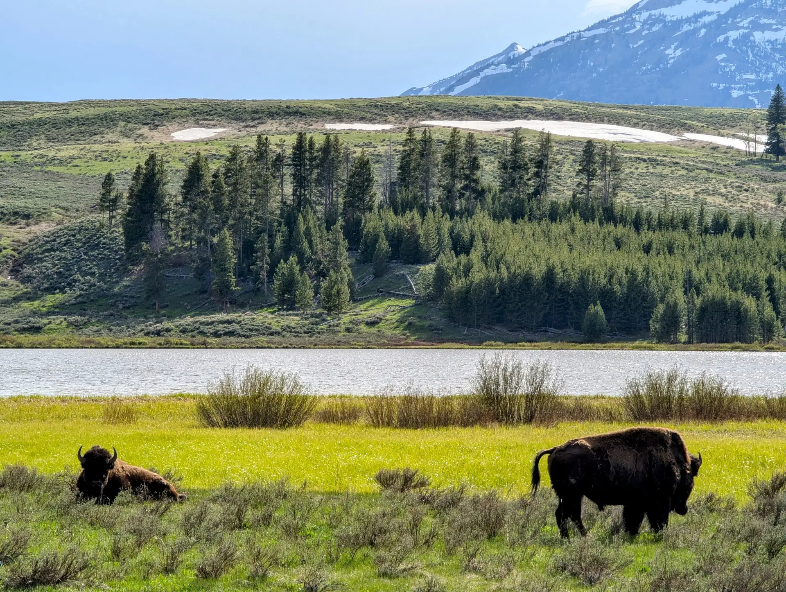

## Yellowstone's Primal Embrace

The air, thick with the scent of sulfur and pine, was a primal welcome. As I drove deeper into **Yellowstone National Park**, the landscape unfolded like a living, breathing testament to Earth's untamed power. Geysers erupted with shocking force, sending columns of scalding water skyward. Hot springs shimmered in impossible hues of turquoise, emerald, and gold, their vibrant beauty born from extreme heat and mineral deposits. Bison, ancient and majestic, roamed freely across vast plains, indifferent to the ribbons of asphalt that carried awe-struck visitors.

Having left the tranquil, yet equally profound, reflections of Martinsville, Indiana behind, **Yellowstone** felt like stepping onto another planet. Every corner revealed a new, volatile wonder. It's a place of constant change, of immense energy bubbling just beneath the surface, a reminder that even the most seemingly stable ground can shift and transform with dramatic force. This environment offers a unique lens for a deep **Yellowstone reentry reflection**.

## Echoes of Confinement in Open Space

And as I soaked in this majestic scene, the memories, as they often do, began to surface. The concrete walls that once defined my world, the echoing clang of steel doors, the suffocating lack of personal space – these stark images flashed through my mind. It's a reflex now, this involuntary comparison between the freedom I now experience and the confinement that was once my reality. This ongoing **Yellowstone reentry reflection** is central to understanding the full scope of life after incarceration.

Here, on the open mountainside, there were no walls. The only boundaries were the horizon itself, stretching out in an invitation to explore. The wind whispered secrets through the pines, a far cry from the muffled conversations and regulated sounds of prison life. The sheer scale of the wilderness dwarfed any sense of constraint, replacing it with an overwhelming feeling of openness. This visceral freedom is what many **returning citizens** yearn for, and often struggle to fully grasp, even after release.

## Yellowstone's Lessons in Reentry

I found myself particularly drawn to the Grand Prismatic Spring, its vibrant, almost alien colors created by thermophilic bacteria thriving in the harsh, hot mineral waters. It's a testament to life finding a way, to beauty emerging from conditions that seem utterly inhospitable. This felt profoundly resonant with the **reentry journey**. It's a harsh environment, riddled with challenges that can feel overwhelming. Yet, within this struggle, individuals find incredible strength, adapt, and create new, vibrant lives for themselves – a kind of beauty forged in the fires of adversity.

Observing the wildlife, particularly the bison, calmly navigating the landscape, seeking sustenance and belonging within their herd, brought a different kind of reflection. They find their place in a complex ecosystem. For **returning citizens**, finding one's place in society after years of separation can feel like navigating an entirely foreign ecosystem. The subtle cues, the social norms, the simple act of belonging can be a struggle, particularly when past mistakes cast a long shadow. This constant self-reflection is part of the **Yellowstone reentry journey**.

## Inspiring the RC Journey

This visit to Yellowstone reinforces the core mission of RC Journey. It's about more than just marveling at nature's grandeur. It's about using these moments of awe to deepen our understanding of the human experience, particularly the arduous path of reentry. The raw, beautiful power of **Yellowstone**, with its hidden forces and constant transformations, serves as a powerful metaphor for the internal strength and external pressures faced by those striving to rebuild their lives.

My journey here is a personal exploration, a continued process of healing and growth. But it's also a commitment to shine a light on the struggles of my fellow **returning citizens**. Just as Yellowstone reminds us of Earth's enduring power, the stories shared on RC Journey aim to remind us of the incredible resilience of the human spirit. The road ahead for many RCs remains unpredictable, like a geyser about to erupt, but with perseverance, support, and the enduring hope that springs from within, new paths can always be forged, as boundless and beautiful as the wilderness itself.

## Gallery

[A pair of bison relaxing in a field in Yellowstone National Park](./images/PXL_20250529_2356279302-scaled.webp) [Sheer cliffs in Yellowstone National Park overlooking the Gibbon River](./images/PXL_20250529_2314306932-scaled.webp) [Serene Gibbon River flowing through Yellowstone National Park](./images/PXL_20250529_2311394142-scaled.webp) [Two cubs and a momma brown bear hanging out in Yellowstone National Park](./images/PXL_20250529_2302558872-scaled.webp) [Beautiful view of the Yellowstone river from a rest area in Montana](./images/PXL_20250528_1440455682-scaled.webp) [Peaceful creek snaking its way through Yellowstone National Park](./images/PXL_20250529_2111583172-scaled.webp) [Beautiful thermal spring overlooking Yellowstone](./images/PXL_20250530_0024291812-scaled.webp) [Gorgeous thermal spring overlooking Yellowstone](./images/PXL_20250530_0025162282-scaled.webp) [Boardwalk to Yellowstone's Clearwater Spring](./images/PXL_20250529_2110245502-scaled.webp) [Bison in the far-off distance grazing in the park](./images/PXL_20250529_2113055592-scaled.webp) [Overlooking the village at Yellowstone National Park](./images/PXL_20250529_2254078132-scaled.webp) [Tranquil stream flowing through the heart of Yellowstone National Park](./images/PXL_20250529_2326574882-scaled.webp) [Trail heading off into Yellowstone National Park](./images/PXL_20250529_2332407372-scaled.webp) [Bison relaxing in a field in Yellowstone National Park](./images/PXL_20250529_2357387732-scaled.webp) [Majestic mountains visible from Yellowstone National Park](./images/PXL_20250529_2358024082-scaled.webp) [Layers of sulfur deposits built up over time in Yellowstone National Park](./images/PXL_20250530_0016171372-scaled.webp) [Stacks of deposits have built up over the ages to create some amazing structures in Yellowstone National Park](./images/PXL_20250530_0019083232-scaled.webp) [Thermal springs overlooking the valley at Yellowstone National Park](./images/PXL_20250530_0022480212-scaled.webp) [Gorgeous, multi-colored springs in Yellowstone National Park](./images/PXL_20250530_0025029732-scaled.webp) [Thermal spring overlooking a valley at Yellowstone National Park](./images/PXL_20250530_0025092722-scaled.webp) [Sign warning of hazardous thermal ground at Yellowstone National Park](./images/PXL_20250530_0026550112-scaled.webp)
